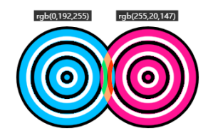

# 11.3 深入了解 CSS 混合模式

CSS 有下面 3 个混合模式相关属性：

- background-blend-mode 属性用于混合元素背景图案、渐变和颜色；
- mix-blend-mode 属性用于元素与元素之间的混合；
- isolation 属性用在祖先元素上，限制 mix-blend-mode 属性设置的混合模式的应用范围。

其中，mix-blend-mode 属性和 background-blend-mode 属性支持的混合模式类型是一样的，总共有 16 种混合模式类型，如表：

| 混合模式类型 |   释义   |
| ------------ | :------: |
| normal       |   正常   |
| multiply     | 正片叠底 |
| screen       |   滤色   |
| overlay      |   叠加   |
| darken       |   变暗   |
| lighten      |   变亮   |
| color-dodge  | 颜色变淡 |
| color-burn   | 颜色加深 |
| hard-light   |   强光   |
| soft-light   |   柔光   |
| difference   |   差值   |
| exclusion    |   排除   |
| hue          |   色调   |
| saturation   |  饱和度  |
| color        |   颜色   |
| luminosity   |   亮度   |

下面以 mix-blend-mode 属性为例

## 11.3.1 详细了解各种混合模式效果

所有这些混合模式的算法在任意图形图像处理领域都是通用的，一次学习，终生受用。

### 1.mix-blend-mode:multiply

值 multiply 的混合效果是[正片叠底](https://jingyan.baidu.com/article/cb5d610540ed3a405d2fe010.html)，最终效果表现的色值的计算公式是：

```bash
C = AB / 255
```

`例如：`
已知颜色关键字 deepskyblue 的 RGB 色值是 rgb(0,192,255)，颜色关键字 deeppink 的 RGB 色值是 rgb(255,20,147)，则这两种颜色进行正片叠底混合后的色值是 rgb(0,15,147)，计算过程如下：


`注意：`
任意颜色和黑色（色值是 0）正片叠底后一定是黑色，任意颜色和白色（色值是 255）正片叠底后一定是当前颜色。由于 和 的 RGB 色值最大就是 255，因此，除和黑、白两色混合时颜色不变之外，和其他颜色混合的正片叠底效果一定是会变暗的。也就是说，正片叠底可以增强两张图像中暗的部分，其表现就像两张半透明相片叠在一起放在发光的桌子上，因此称为“正片叠底”。

例子：mix-blend-mode-multiply.html

### 2.mix-blend-mode:screen

值 screen 的混合效果是[滤色](https://zhidao.baidu.com/question/346333236.html)，最终效果的色值的计算公式是：

```bash
C = 255 - (255-A)(255-B) / 255
```

screen 的效果和 multiply 正好相反，multiply 的效果是混合后颜色变暗，而 screen 则是混合后颜色变亮。因为滤色混合模式将两个混合颜色的互补色值相乘，然后除以 255。

- 任何颜色和黑色进行滤色混合后，还是呈现原来的颜色；
- 任何颜色和白色进行滤色混合后得到的仍是白色；
- 任何颜色和其他颜色进行滤色混合后，颜色会更浅，有点类似漂白的效果


`应用：`滤色模式非常适合用于在图像中创建霓虹辉光效果，这一特性在 Web 开发中也同样有用。

我们经常需要对一些图像素材添加场景特效，如各种天气效果或者霓虹辉光效果等。传统做法是使用一张透明的 PNG 图像作为前
景图，但是使用 PNG 透明前景图有下面两个缺点：

- 效果不自然，缺少与底图完全融为一体的感觉；
- 图片文件实在是太大了，动不动就上百 KB。

一张黑色 JPG 图像和底图融合效果好（因为使用滤色混合模式的时候，黑色会被视为透明）

[相关 demo](https://demo.cssworld.cn/new/11/3-3.php)

### 3．mix-blend-mode:overlay

值 overlay 的混合效果是[叠加](https://zhidao.baidu.com/question/1805822118585561787.html)，最终效果的色值的计算公式所示（ 表示底图的色值）：

- 当 A <= 128

```bash
C = AB / 128
```

- 当 A > 128

```bash
C = 255 - (255-A)(255-B) / 128
```

从上面公式可以看出，在底图色值小于或等于 128 的时候，采用了类似“正片叠底”的算法，而底图色值大于 128 的时候，采用了类似“滤色”的算法，因此，叠加这种混合模式的底图的高光（白色）和阴影（黑色）的颜色会被保留，其他颜色的饱和度和对比度会有一定的提高，混合后的图像看起来会更鲜亮。叠加的效果如图


叠加效果在 Web 中主要有两个应用场景，一个是在图像上显示文字水印，另一个是着色叠加。

[\*文字水印和着色叠加 demo](https://demo.cssworld.cn/new/11/3-4.php)

例子：mix-blend-mode-overlay.html

### 4．mix-blend-mode:darken

值 darken 的混合效果是变暗，表示将两种颜色的 RGB 通道值依次进行比较，哪个色值小就使用哪个色值。最终效果的色值的计算公式是：

```bash
C = min(A, B)
```


### 5．mix-blend-mode:lighten

值 lighten 的混合效果是变亮，表示将两个颜色的 RGB 通道值依次进行比较，哪个色值大就使用哪个色值。最终效果的色值的计算公式是：

```bash
C = max(A, B)
```


### 6．mix-blend-mode:color-dodge

值 color-dodge 的混合效果是颜色变淡，最终效果的色值的计算公式是：

```bash
C = A + AB/(225 - B)
```


### 7．mix-blend-mode:color-burn

值 color-burn 的混合效果是颜色加深，最终效果的色值的计算公式是：

```bash
C = A - (255 - A)(255-B)/B
```


### 8．mix-blend-mode:hard-light

值 hard-light 的混合效果是强光，就好像耀眼的聚光灯照射过来，表现为图像亮的地方更亮，暗的地方更暗。最终效果的色值的计算公式如下所示：


### 9．mix-blend-mode:soft-light

值 soft-light 的混合效果是柔光，就好像发散的光源四处弥漫，它的表现效果和 hard-light 有类似之处，只是表现没有 hard-light 那么强烈。例如纯黑或纯白的上层元素与底层元素混合后的效果仅仅是元素轻微变暗或变亮，而不是变成纯黑或纯白。柔光混合模式的计算公式比较复杂，如下所示。


[soft-light 和 hard-light 混合模式效果对比 demo](https://demo.cssworld.cn/new/11/3-6.php)

可以看出，对于自然景色的图像，柔光模式的着色效果要更自然一些。

### 10．mix-blend-mode:difference

值 difference 的混合效果是差值，最终颜色的色值是用较浅颜色的色值减去较深颜色的色值的结果，计算公式是：

```bash
C = |A - B|
```



[mix-blend-mode:difference 显示不同文字颜色 demo](https://demo.cssworld.cn/new/11/3-7.php)

### 11．mix-blend-mode:exclusion

值 exclusion 的混合效果是排除，最终的混合效果和 difference 模式是类似的，区别在于 exclusion 的对比度要更低一些。最终效果的色值的计算公式是：

```bash
C = A + B - AB / 128
```


[difference 和 exclusion 混合模式效果对比 demo](https://demo.cssworld.cn/new/11/3-8.php)

### 12．mix-blend-mode:hue

值 hue 表示色调混合，作用是将颜色混合，使用底层元素的亮度和饱和度，以及上层元素的色调。


### 13．mix-blend-mode:saturation

值 saturation 表示饱和度混合，混合后的颜色保留底图的亮度和色调，并使用顶图的饱和度。


### 14．mix-blend-mode:color

值 color 表示颜色混合，混合后的颜色保留底图的亮度，并使用顶图的色调和饱和度。


[颜色系混合模式和色盘混合效果 demo](https://demo.cssworld.cn/new/11/3-9.php)

### 15．mix-blend-mode:luminosity

值 luminosity 表示亮度混合，混合后的颜色保留底图的色调和饱和度，并使用顶图的亮度，效果和 color 模式正好是相反的。


## 11.3.2 滤镜和混合模式的化合反应

### 使用白天素材模拟夜晚、照片美化、照片风格化处理

[filter](https://www.runoob.com/cssref/css3-pr-filter.html)

[demo](https://demo.cssworld.cn/new/11/3-10.php)
