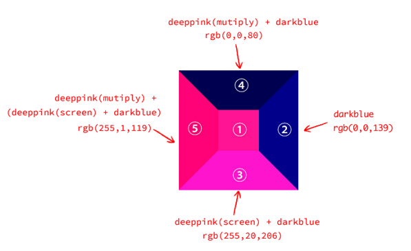

# 11.4 混合模式属性 background-blend-mode

background-blend-mode 属性可以在各个背景图像之间应用混合模式。

background-blend-mode 属性的使用频率要明显低于 mix-blend- mode 属性，原因有以下两个。

- 真实世界的照片很少作为 background-image 背景图像呈现，因为不利于无障碍访问，而混合模式设计的初衷就是处理这类照片。
- background-blend-mode 属性的作用机制不像 mix-blend-mode 属性那么单纯，很多开发者并不能很好地驾驭它。例如使用混合模式让透明背景的小图标变成渐变图标，很多人会使用 mix-blend-mode 属性实现，但是能够使用 background-blend-mode 属性实现的人寥寥无几。

## 11.4.1 background-blend-mode 属性的常见应用

例子：background-blend-mode-multiply.html

## 11.4.2 深入了解 background-blend-mode 属性的作用细节

- background-blend-mode 属性本身就带有隔离特性，也就是一个元素应用 background-blend-mode 背景混合模式，最终的效果只会受当前元素的背景图像和背景颜色影响，不会受视觉上处于当前区域的其他任意元素影响。
- 应用 background-blend-mode 属性后，不仅各张图像之间要进行混合，各张图像还要和背景色进行混合。

### 1．背景顺序影响混合效果

混合效果和 background 属性中背景图像的顺序密切相关。在 CSS 多背景中，语法越靠后的背景图像的层级越低，这也是 background-color 要写在最后语法才合法的原因，即背景色的层级永远是最低的。

设置背景混合模式为叠加，但是两个元素的背景图像的顺序是相反的，例子如下：

例子：background-blend-mode-overlay.html

### 2．混合效果是多个混合属性同时作用的结果

很多开发者并不清楚，background-blend-mode 属性其实可以设置多个混合模式值，分别对应不同的背景图像，这一点和只支持一个混合模式值的 mix-blend-mode 属性是不一样的。例
如：

```css
.ball {
  background: linear-gradient(deeppink, deeppink), linear-gradient(deepskyblue, deepskyblue);
  background-blend-mode: overlay;
}
```

实际上等同于：

```css
.ball {
  background: linear-gradient(deeppink, deeppink), linear-gradient(deepskyblue, deepskyblue);
  background-blend-mode: overlay overlay;
}
```

实际上每张背景图像都有一个自己的混合模式值，这和 mix-blend-mode 属性有着巨大区别！通常，在使用 mix-blend-mode 属性的场景中，我们只会把混合模式设置在顶层元素上，而不会给每一层元素都设置，于是这就带来了一个由此及彼的严重的思维误区，一些开发者会以为背景混合模式设置的值也是作用在顶层的背景图像上的，结果却发现 background-blend-mode 属性的渲染表现和预期的不一样。

例子：background-blend-mode.html


