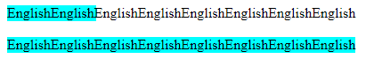
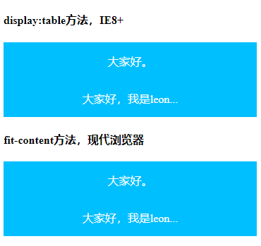
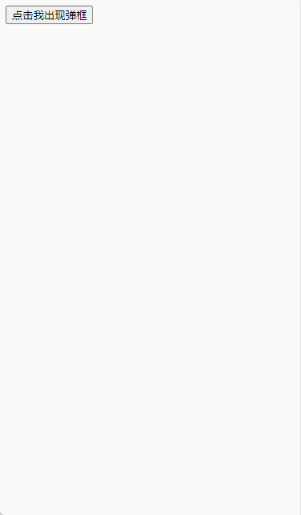
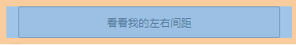
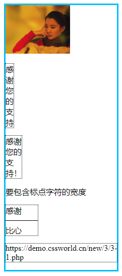
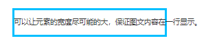

# 3.1 贯穿全书的尺寸体系

1. Intrinsic Sizing(内在尺寸)：表示元素最终的尺寸表现是由内容决定的
2. Extrinsic Sizing(外在尺寸)：表示元素最终的尺寸表现是由上下文决定的

CSS 的 width 属性新增了 4 个与尺寸概念相匹配的关键字，包括 fit-content、fill- available、min-content 和 max-content

## 3.1.1 从 width:fit-content 声明开始

**1.包裹性**
::: details 代码实现

```html
<!DOCTYPE html>
<html lang="en">
  <head>
    <meta charset="UTF-8" />
    <meta http-equiv="X-UA-Compatible" content="IE=edge" />
    <meta name="viewport" content="width=device-width, initial-scale=1.0" />
    <title>fit-content(包裹性)</title>
    <style>
      .box1 {
        background-color: aqua;
        width: 100px;
      }

      .box2 {
        width: -moz-fit-content;
        width: fit-content;
        background-color: aqua;
      }
    </style>
  </head>

  <body>
    <div class="box1">
      EnglishEnglishEnglishEnglishEnglishEnglishEnglishEnglish
    </div>

    <br />

    <div class="box2">
      EnglishEnglishEnglishEnglishEnglishEnglishEnglishEnglish
    </div>
  </body>
</html>
```

效果：



:::

**2.水平居中**
::: details 代码实现

```html
<!DOCTYPE html>
<html lang="en">
  <head>
    <meta charset="UTF-8" />
    <meta http-equiv="X-UA-Compatible" content="IE=edge" />
    <meta name="viewport" content="width=device-width, initial-scale=1.0" />
    <title>fit-content(水平居中)</title>
    <style>
      .cw-box {
        padding: 1em;
        background-color: deepskyblue;
        color: #fff;
      }

      .cw-content-1 {
        display: table;
        margin: auto;
      }

      .cw-content-2 {
        width: -moz-fit-content;
        width: fit-content;
        margin: auto;
      }
    </style>
  </head>

  <body>
    <h4>display:table方法，IE8+</h4>
    <div class="cw-box">
      <div class="cw-content-1">谢谢大家。</div>
    </div>
    <div class="cw-box">
      <div class="cw-content-1">谢谢大家购买我的书籍，如果你...</div>
    </div>

    <h4>fit-content方法，现代浏览器</h4>
    <div class="cw-box">
      <div class="cw-content-2">谢谢大家。</div>
    </div>
    <div class="cw-box">
      <div class="cw-content-2">谢谢大家购买我的书籍，如果你...</div>
    </div>
  </body>
</html>
```

效果：



:::

**3.绝对定位元素 fit-content 居中布局最佳实践**
::: details 代码实现

```html
<!DOCTYPE html>
<html lang="en">
  <head>
    <meta charset="UTF-8" />
    <meta http-equiv="X-UA-Compatible" content="IE=edge" />
    <meta name="viewport" content="width=device-width, initial-scale=1.0" />
    <title>绝对定位元素fit-content居中布局最佳实践</title>
    <style>
      /* 兼容到IE9+ */
      .cw-dialog {
        position: absolute;
        left: 50%;
        top: 50%;
        transform: translate(-50%, -50%);
        border: 3px solid #bfa;
        z-index: 19;
      }

      .cw-dialog:not([open]) {
        display: none;
      }

      /* fit-content渐进增强实现 */
      .cw-dialog {
        box-sizing: border-box;
        width: fit-content;
        height: fit-content;
        left: 0;
        top: 1em;
        right: 0;
        bottom: 1em;
        margin: auto;
        /* 小动画 */
        animation: tinyUp 0.5s both;
      }

      img {
        width: 300px;
        height: 200px;
        vertical-align: bottom;
        /* 行内标签，而行内标签默认的是基线对齐而不是底线对齐 */
      }

      @keyframes tinyUp {
        from {
          transform: translateY(100px);
        }

        to {
          transform: translateY(0);
        }
      }
    </style>
  </head>

  <body>
    <button id="button">点击我出现弹框</button>

    <div id="dialog" class="cw-dialog">
      
    </div>
  </body>

  <script>
    document.addEventListener("click", (event) => {
      if (event.target && event.target.id == "button") {
        dialog.setAttribute("open", "");
      } else {
        dialog.removeAttribute("open");
      }
    });
  </script>
</html>
```

效果：



:::

## 3.1.2 stretch、available 和 fill-available 关键字究 竟用哪个

stretch、available 和 fill-available 这 3 个关键字虽然名称有所不同，但是作用都是一致的，那就是让元素的尺寸自动填满可用空间，就如同 div 元素的默认尺寸表现

- stretch 指“弹性拉伸”，是最新的规范中定义的关键字，替换之前的 fill-available 和 available。
- available 指“可用空间”，是 Firefox 浏览器使用的关键字，需要配合-moz-私有前缀使用。
- fill-available 指“填充可用空间”，是 webkit 浏览器使用的关键字，需要配合-webkit-私有前缀使用。因此，立足现在，面向未来，我们的 CSS 应该这么写

```css
.element {
  width: -webkit-fill-available;
  width: -moz-available;
  width: stretch;
}
```

1.stretch 关键字的应用场景

```html
<!DOCTYPE html>
<html lang="en">
  <head>
    <meta charset="UTF-8" />
    <meta http-equiv="X-UA-Compatible" content="IE=edge" />
    <meta name="viewport" content="width=device-width, initial-scale=1.0" />
    <title>stretch关键字与button按钮的margin自适应</title>
    <style>
      button {
        height: 40px;
        /* width: calc(100% - 30px);  兼容IE/Edge */
        width: -webkit-fill-available;
        width: -moz-available;
        width: stretch;
        margin-left: 15px;
        margin-right: 15px;
        box-sizing: border-box;
      }
    </style>
  </head>

  <body>
    <button>看看我的左右间距</button>
  </body>
</html>
```

效果：



注意：  
如果宽度自适应拉伸效果用在 table 元素上，就不要再使用 -moz-available

## 3.1.3 min-content 关键字

::: details 代码实现

```html
<!DOCTYPE html>
<html lang="en">
  <head>
    <meta charset="UTF-8" />
    <meta http-equiv="X-UA-Compatible" content="IE=edge" />
    <meta name="viewport" content="width=device-width, initial-scale=1.0" />
    <title>min-content首选最小宽度测试</title>
    <style>
      div {
        display: inline-block;
        width: min-content;
        border: solid deepskyblue;
      }

      div p {
        width: min-content;
        outline: 1px dotted;
      }
    </style>
  </head>

  <body>
    <div>
      
      <p>感谢您的支持</p>
      <p>感谢您的支持！</p>
      <p>感谢————比心</p>
      <p>https://demo.cssworld.cn/new/3/3-1.php</p>
    </div>
  </body>
</html>
```

效果：



注意：

1. CJK 没有标点的中文文字，则首选最小宽度是单个汉字的宽度
2. 如果这段中文文字包含避头标点[1]或避尾标点[2]，同时 line-break 的属性值不是 anywhere，则最终的首选最小宽度需要包含标点字符的宽度
3. 无论在哪个浏览器中，连续的中文破折号都会被认为是一个字符单元
4. 非 CJK 文字：所有连续的英文字母、数字和标点都被认为是一个字符单元，直到遇到中断字符 （空格、-、。。。）
5. 短横线后面的字符不是字母，而是其他标点，如`min-.content`，则不会换行

:::

## 3.1.4 max-content 关键字

::: details 代码实现

```html
<!DOCTYPE html>
<html lang="en">
  <head>
    <meta charset="UTF-8" />
    <meta http-equiv="X-UA-Compatible" content="IE=edge" />
    <meta name="viewport" content="width=device-width, initial-scale=1.0" />
    <title>6-max-content最大内容宽度使用测试</title>
    <style>
      .container {
        border: solid deepskyblue;
      }

      .container > p {
        width: max-content;
      }
    </style>
  </head>

  <body>
    <div class="container">
      <p>可以让元素的宽度尽可能的大，保证图文内容在一行显示。</p>
    </div>
  </body>
</html>
```

效果：



注意：

1. max-content 关键字和 min-content 关键字的兼容性一样，IE 浏览器和 Edge 浏览器都不支持，其他浏览器都支持，因此这两个关键字在移动端项目中是可以放心使用的
2. 推荐大家使用 width:max-content，而不是 white-space:nowrap。因为使用 width:max-content 更有档次，可以彰显自己的 CSS 技术深度

:::
