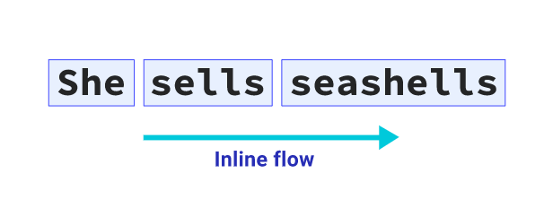
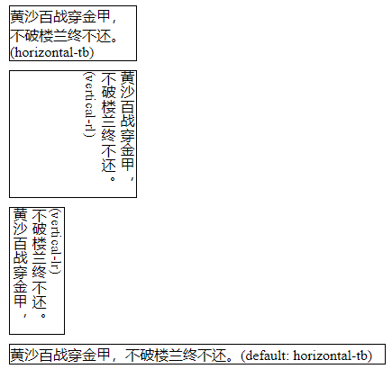
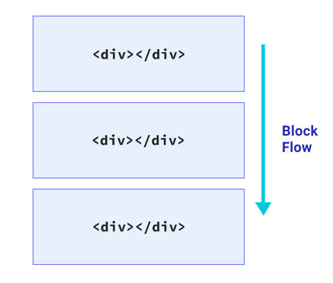
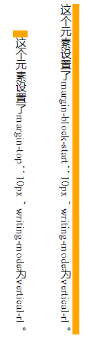
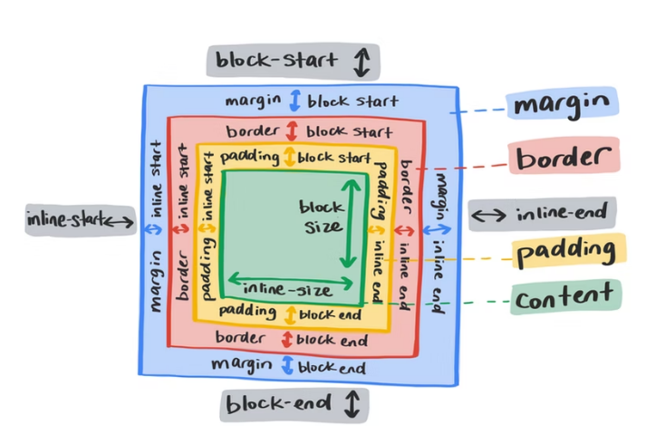
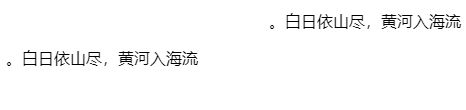

# 3.2 深入了解 CSS 逻辑属性

## 1.内联流（Inline flow）

**内联流**的方向就是一行文本的书写方向（页面渲染一行文字的方向）。在英文文档中内内联流的方向是从左至右。如果你将网页页面语言更改为 Arabic（\<html lang="ar">），内联流方向将变为从右至左。



文本流动的方向由页面的书写模式决定。我们可以通过更改 `writing-mode` 来更改文字的流动方向。`writing-mode` 可以设置以下几种值：

- `horizontal-tb`：文本流的方向是水平方向的（从左至右），元素是从上往下（tb：top-bottom）堆叠。
- `vertical-rl`：文本流的方向是竖直方向的（从上至下），元素是右至左（rl：right-left）堆叠，与我们国家古代的书写方式一致，阅读方向是从右至左的。
- `vertical-lr`：文本流的方向是竖直方向的（从上至下），元素是左至右（lr：left-right）堆叠。

::: details 例子

```html
<!DOCTYPE html>
<html lang="en">
  <head>
    <meta charset="UTF-8" />
    <meta http-equiv="X-UA-Compatible" content="IE=edge" />
    <meta name="viewport" content="width=device-width, initial-scale=1.0" />
    <title>Document</title>
    <style>
      .p1,
      .p2,
      .p3,
      .p4 {
        border: 1px solid black;
        margin: 10px;
      }

      .p2,
      .p3 {
        height: 140px;
      }

      .p1,
      .p2 {
        width: 140px;
      }

      .p1 {
        writing-mode: horizontal-tb;
      }

      .p2 {
        writing-mode: vertical-rl;
      }

      .p3 {
        writing-mode: vertical-lr;
      }
    </style>
  </head>

  <body>
    <p class="p1">黄沙百战穿金甲，不破楼兰终不还。 (horizontal-tb)</p>
    <p class="p2">黄沙百战穿金甲，不破楼兰终不还。(vertical-rl)</p>
    <p class="p3">黄沙百战穿金甲，不破楼兰终不还。(vertical-lr)</p>
    <p class="p4">黄沙百战穿金甲，不破楼兰终不还。(default: horizontal-tb)</p>
  </body>
</html>
```

效果：



:::

## 2.块流（Block flow）

**块流**（Block flow）指的是块排列的方向。例如有两个段落，块流动的方向就是从第一个块到第二个块。在英文文档中，块流动方向是从上到下。

下一个段落在上一个段落的下方。



## 3.相对流

很多时候，我们设置元素的某一侧（上下左右）的边距、边框等都是相对于元素的物理方向的，例如 `margin-top` 属性设置的是元素的上侧外边距，类似 `margin-top`、`padding-top` 和 `border-top` 这种属性称之为物理属性（非逻辑属性），它们不受元素的流动方向的影响。

有一些属性值，会随着元素的流动方向（语言和文字书写方向）产生不同的效果，这种属性叫做相对流逻辑属性（后面简称逻辑属性），逻辑属性通常很少用到，所以很容易被我们所忽视。

通过设置逻辑属性，我们可以设置元素边距和边框等随着元素流的方向而变化。例如 `margin-block-start` 会受块流方向的影响。

::: details 例子

```html
<!DOCTYPE html>
<html lang="en">
  <head>
    <meta charset="UTF-8" />
    <meta http-equiv="X-UA-Compatible" content="IE=edge" />
    <meta name="viewport" content="width=device-width, initial-scale=1.0" />
    <title>Document</title>
    <style>
      .wrap {
        display: inline-block;
        background-color: orange;
        margin: 20px;
      }

      .p1,
      .p2 {
        background: white;
        writing-mode: vertical-rl;
      }

      .wrap .p1 {
        margin-top: 10px;
      }

      .wrap .p2 {
        margin-block-start: 10px;
      }
    </style>
  </head>

  <body>
    <div class="wrap">
      <div class="p1">
        这个元素设置了margin-top：10px，writing-mode为vertical-rl。
      </div>
    </div>

    <div class="wrap">
      <div class="p2">
        这个元素设置了margin-block-start：10px，writing-mode为vertical-rl。
      </div>
    </div>
  </body>
</html>
```

效果：



:::

通过 `margin-block-start` 属性名和上面的 demo，可以猜到该属性受 block 流的方向影响并且设置的是 `block` 流的起始方向。类似的属性还有 `margin-block-end`、 `margin-inline-start`、`margin-inline-end`、`padding-inline-start`、`padding-inline-end`、`border-block-start` 和 `border-block-end` 等。



## 4.尺寸

为了防止元素尺寸超出某个确定的范围，可以通过 `width` 和 `height` 给元素添加一个固定的最大值最小值尺寸用于限制元素尺寸：

```css
.box {
  max-width: 150px;
  max-height: 100px;
}
```

同样 `max-width` 和 `max-height` 也有对应的逻辑属性：

- `max-inline-size`：内联流方向上的最大尺寸。
- `max-block-size`：块流方向上的最大尺寸。
- `min-inline-size`：内联流方向上的最小尺寸。
- `min-block-siz`e：块流方向上的最小尺寸。

以上属性都受 `writing-mode` 影响，在默认值 `horizontal-tb` 时，`max-inline-size` 和 `min-inline-size` 设置的是水平方向的最大值和最小值，`max-block-size` 和 `min-block-size` 设置的是竖直方向的最大值和最小值，因为此时内联方向为水平方向，块方向是竖直方向。

## 5.start 和 end

某些属性支持 `start` 和 `end` 作为属性值，用来代替 `top`、`right`、`bottom` 和 `left`，`start` 和 `end` 可以设置 `block-start`、`inline-end`、`block-end` 和 `inline-start` 方向，这样可以让属性受 `writing-mode` 和 `direction` 的影响，变成一个逻辑属性。

例如，将文字右对齐，你可以通过 text-aling 设置：

```css
p {
  text-align: right;
}
```

如果你的目标不是设置文字物理方向上的右对齐，而是受 `wrigin-mode` 的影响，那么你可以设置属性值为 `start` 和 `end`

```css
p {
  text-align: end;
}
```

::: details 例子

```html
<!DOCTYPE html>
<html lang="en">
  <head>
    <meta charset="UTF-8" />
    <meta http-equiv="X-UA-Compatible" content="IE=edge" />
    <meta name="viewport" content="width=device-width, initial-scale=1.0" />
    <title>Document</title>
    <style>
      .p1,
      .p2 {
        direction: rtl;
      }

      .p1 {
        text-align: right;
      }

      .p2 {
        text-align: end;
      }
    </style>
  </head>

  <body>
    <p class="p1">白日依山尽，黄河入海流。</p>
    <p class="p2">白日依山尽，黄河入海流。</p>
  </body>
</html>
```

效果：



使用了 `direction` 属性改变了水平文本的方向。`direction` 接受 `ltr`、`rtl` 作为值。`p2` 的 `text-align` 为 `end`，`direction` 为 `rtl`，所以此时 `end` 为左侧

:::
