# 4.4 CSS 2D 变换

## 4.4.1 从基本的变换方法说起

```css
/* 位移 */
transform: translate(0, 0);
/* 旋转 */
transform: rotate(0deg);
/* 缩放 */
transform: scale(1);
/* 斜切 */
transform: skew(0deg);
```

### 1．translate()位移

以自身坐标为基准，进行水平方向或垂直方向的位移，语法如下:

```css
/* 往右偏移10px，往下偏移20px */
transform: translate(10px, 20px);
/* 往右偏移10px */
transform: translateX(10px);
/* 往下偏移20px */
transform: translateY(20px);
```

注意：

1. 其中，translate()函数中的第二个值可以省略，省略后表示垂直方向的偏移大小是 0。因此，translate(10px)等同于 translate(10px, 0)，也等同于 translateX(10px)。大家千万不要被 scale()函数的语法给误导，translate(10px)不是 translate(10px, 10px)的简写
2. 位移的方向和文档流的顺序没有任何关系，也就是即使祖先元素设置 direction:rtl，translateX(10px)依然表示往右偏移。

位移变换最不可替代的特性就是设定百分比偏移值，因为 CSS
世界中就没有几个属性的百分比值是相对于自身尺寸计算的，示例
如下：

```css
/* 往左偏移自身宽度的一半，往上偏移自身高度的一半 */
transform: translate(-50%, -50%);
```

居中定位：

```css
.dialog {
  position: absolute;
  left: 50%;
  top: 50%;
  transform: translate(-50%, -50%);
}
```

### 2．rotate()旋转

旋转 45 度 (顺时针)：

```css
transform: rotate(45deg);
```

- 角度（deg）：角度范围为 0 ～ 360 度，角度为负值可以理解为逆时针旋转。例如，−45deg 可以理解为逆时针旋转 45 度。
- 百分度（grad）：一个梯度，或者说一个百分度表示 1/400 个整圆。因此 100gads 相当于 90deg，它和 deg 单位一样支持负值，负值可以理解为逆时针方向旋转。
- 弧度（rad）：1 弧度等于 180/π 度，或者大致等于 57.3 度。1.5708rad 相当于 100gads 或是 90deg，如图 所示。
- 圈数（turn）：这个很好理解，1 圈表示 360 度，平时体操或跳水中出现的“后空翻 720 度”，也就是后空翻两圈的意思。于是有等式 1turn=360deg、2turn=720deg 等。

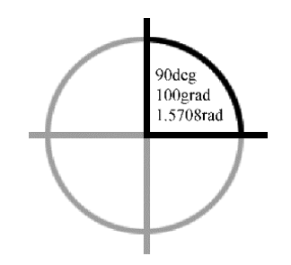

下面的 CSS 代码均表示顺时针旋转 45 度：

```css
transform: rotate(45deg);
transform: rotate(50gads);
transform: rotate(0.7854rad);
transform: rotate(0.25turn);
```

注意：实际开发的时候，只需要使用 deg 单位就好了，没必要
“炫技”使用其他角度单位

### 3．scale()缩放

缩放变换也支持 和 两个方向，因此，下面的语法都属于 2D 变换的语法：

```css
/* 水平放大2倍，垂直缩小1/2*/
transform: scale(2, 0.5);
/* 水平放大2倍 */
transform: scaleX(2);
/* 垂直缩小1/2*/
transform: scaleY(0.5);
```

注意：

1. 缩放变换不支持百分比值，仅支持数值，因此 scale(200%,50%)是无效的。

2. 缩放变换支持负值。如果我们想要实现元素的水平翻转效果，可以设置 transform:scaleX(-1)；想要实现元素的垂直翻转效果，可以设置 transform:scaleY(-1)。如果水平缩放和垂直缩放的大小一样，我们可以只使用一个值，例如，transform:scale(2)表示将元素水平方向和垂直方向的尺寸放大到现有尺寸的 2 倍。

### 4．skew()斜切

斜切变换也支持 和 两个方向，例如：

```css
/* 水平切斜10度，垂直切斜20度 */
transform: skew(10deg, 20deg);
/* 水平切斜10度 */
transform: skewX(10deg);
/* 垂直切斜20度 */
transform: skewY(20deg);
```

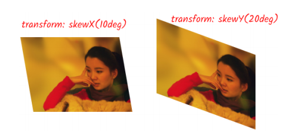

注意：

1. 所有包含 X 和 Y 字符的变换函数都不区分大小写，例如 skewX(10deg)写作 skewx(10deg)是正确，translateX(10px)写作 translatex(10px)也是正确的，不过我们约定俗成字符 X 和 Y 都是大写。skew(10deg)可以看成 skew(10deg, 0)的简写，效果等同于 skewX(10deg)。

2. 旋转是 360 度一个轮回，斜切则是 180 度一个轮回。元素处于 90 度或者 270 度斜切的时候是看不见的，因为此时元素的尺寸在理论上是无限的。对浏览器而言，尺寸不可能是无限的，因为没办法表现出来！于是这种情况下的尺寸为 0，所以元素在 90 度或者 270 度斜切的时候是不会影响祖先元素的滚动状态的。如果读者对这句话不理解，把 skewY()函数的角度调成 89 度或者 271 度就知道什么意思了。skew()函数支持所有角度单位值。

怎么样绘制以下：


## 4.4.2 transform 属性的若干细节特性

### 1．盒模型尺寸不会变化

页面中的元素无论应用什么 transform 属性值，该元素盒模型的尺寸和位置都不会有任何变化。这和 position:relative 相对定位偏移的行为有些类似。

```css
transform: scale(2);
```

虽然视觉尺寸放大了 2 倍，但是，并不会推开旁边的元素，只会在视觉上重叠与覆盖。

### 2．内联元素无效

内联元素（不包括替换元素）是无法应用 transform 变换的，且不支持所有变换特性。例如：

```css
span {
  transform: translateX(99px);
}
```

### 3．锯齿或虚化的问题

在应用旋转或者斜切变换的时候，元素边缘会表现出明显的锯齿，文字会明显虚化。这个现象主要出现在桌面端浏览器上，而且这个问题是没有办法避免的，因为显示器的密度跟不上。

目前大部分桌面显示器还都是 1 倍屏，显示的最小单元是 1px×1px，你可以理解为显示器屏幕是由一个个 1px×1px 大小的格子组成的。如果像素点旋转 45 度，那么这个正方形像素点的端点和边必然就会穿过其他的格子，如图所示

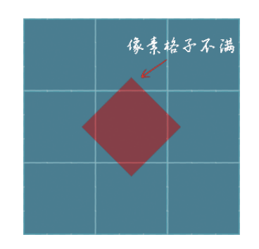

于是，有一个问题出现了，显示器没有能力显示小于 1px×1px 的图形，于是，要么裁剪像素点（锯齿），要么使用算法进行边缘模糊计算（虚化）。因此，要想解决 transform 变换锯齿和虚化的问题，只要把我们的显示器换掉就可以了。换成一个高清屏，类似 iMac 那种 5KB 显示屏，这个现象就没了。因为这类屏幕密度足够高，0.2px×0.2px 的元素都可以细腻渲染。

### 4．不同顺序不同效果

```js
<p></p>
<p></p>
p {
  width: fit-content;
  border: solid deepskyblue;
  }
.transform-1 {
    transform: translateX(40px) scale(.75);
}
.transform-2 {
  transform: scale(.75) translateX(40px);
}
```

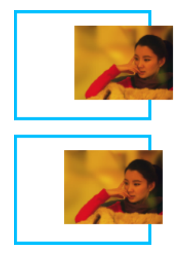

### 5．clip/clip-path 前置剪裁

一个元素应用 transform 变换之后，同时再应用 clip 或者 clip-path 等属性，此时很多人会误认为剪裁的是应用变换之后的图形，实际上不是的，剪裁的还是变换之前的图形，也就是先剪裁再变换。例如：

```css
img {
  width: 128px;
  height: 96px;
  transform: scale(2);
  clip-path: circle(48px at 64px 48px);
}
```

如果是先执行 transform 再执行 clip-path，则最终剪裁的圆的半径应该还是 circle()函数中的 48px，即最终剪裁的圆的直径是 96px；如果是先执行 clip-path 再执行 transform，则最终剪裁的圆的直径应该是 192px，在各个浏览器中实际渲染的结果都是直径为 192px 的圆，如图所示。

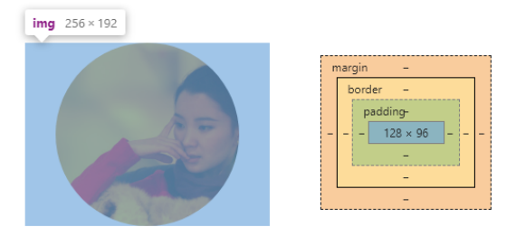

由此可以证明，transform 和 clip-path 同时用的时候，是先执行 clip-path 剪裁，另外一个剪裁属性 clip 也是类似的。

### 6．动画性能优秀

CSS 高性能动画三要素指的是绝对定位、opacity 属性和 transform 属性。因此，同样的动画效果，优先使用 transform 属性实现。例如，元素移动动画应使用 transform 属性，而不是 margin 属性。

## 4.4.3 元素应用 transform 属性后的变化

### 1．创建层叠上下文

和 opacity 属性值不是 1 的元素类似，如果元素的 transform
属性值不是 none，则会创建一个新的层叠上下文。

[叠上下文 demo1](https://demo.cssworld.cn/new/4/4-3.php)

[叠上下文 demo2](https://demo.cssworld.cn/new/4/4-4.php)

### 2．固定定位失效

想要实现固定定位效果，可以应用 position:fixed 声明。大部分情况下，最终的样式表现是符合预期的，但是，如果父元素设置了 transform 变换，则固定定位效果就会失效，样式表现就会类似于绝对定位。例如：

[固定定位失效 demo](https://demo.cssworld.cn/new/4/4-5.php)

### 3．改变 overflow 对绝对定位元素的限制

[demo](https://demo.cssworld.cn/new/4/4-6.php)

### 4．改变绝对定位元素的包含块

过去绝对定位元素的包含块是第一个 position 属性值不为 static 的祖先元素，现在 transform 属性值不为 none 的元素也可以作为绝对定位元素的包含块。例如：

[demo](https://demo.cssworld.cn/new/4/4-7.php)

## 4.4.4 深入了解矩阵函数 matrix()

transform 变换还支持矩阵函数 matrix()。无论是位移、旋转、缩放还是斜切，其变换的本质都是应用矩阵函数 matrix()进行矩阵变换。所谓矩阵变换，就是套用矩阵公式，把原先的坐标点转换成另外一个坐标点的过程。其语法如下：

```css
transform: matrix(a, b, c, d, e, f);
```

matrix()函数的 6 个参数对应的矩阵如图:

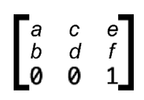

矩阵转换公式示意:

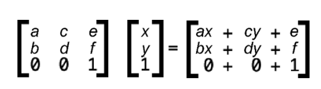

其中， ax+cy+e 表示变换后的水平坐标， bx+dy+f 表示变换后的垂直坐标。

通过一个简单的例子来快速了解一下，假设矩阵参数如下：

```css
transform: matrix(1, 0, 0, 1, 30, 30); /* a=1, b=0, c=0, d=1, e=30, f=30 */
```

随便选取一个点坐标，例如(0, 0)，即 x = 0, y=0 于是，矩阵计算后的 x 坐标就是 ax+cy+e =30  
矩阵计算后的 y 坐标就是 bx+dy+f =30

也就是点坐标从(0, 0)变成了(30, 30)。请读者好好想象一下，原来(0, 0)的位置，经过矩阵变换后就移到了(30, 30)的位置，是不是等同于往右方和下方各偏移了 30px ?

实际上 transform:matrix(1, 0, 0, 1, 30, 30) 等同于 transform:translate (30px, 30px)

注意:
translate()、rotate()等函数都是需要单位的，而 matrix()函数中的参数的单位是省略的。

### 1．位移：translate()函数

位移变换函数 translate(x, y)中的 x 和 y 分别对应 matrix()函数中的 e 和 f 两个参数，语法示意如下：

```css
transform: matrix(a, b, c, d, 水平偏移距离, 垂直偏移距离);
```

只要关心最后 2 个参数就可以了，至于前面 4 个参数，它们和位移变化没有关系。

### 2．缩放：scale()函数

```css
transform: matrix(1, 0, 0, 1, 30, 30); /* a=1, b=0, c=0, d=1, e=30, f=30 */
```

其中参数 a 表示 x 轴缩放大小，参数 d 表示 y 轴缩放大小。

套用矩阵计算公式计算下就明白了，假设原始坐标是 (x, y)，缩放比例是 s ，则：

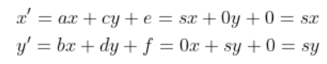

可以看到最终的坐标就是原始坐标按缩放比例缩放的结果，表明参数 a 和参数 d 确实是和缩放相关的矩阵参数。我们不妨测试一下：

:::demo

```vue
<template>
  
</template>
<style>
.scale-img {
  transform: matrix(2, 0, 0, 0.5, 0, 0);
}
</style>
```

:::

### 3．旋转：rotate()函数

旋转要比位移和缩放难一些，需要用到三角函数的知识。假设旋转角度为 ，则矩阵计算方法和参数如下：

[推导过程](http://leoamazing.gitee.io/visual/computer/ComputerGraphics.html#_3-%E5%8F%98%E6%8D%A2)

```css
matrix(cosθ, sinθ, -sinθ, cosθ, 0, 0)
```

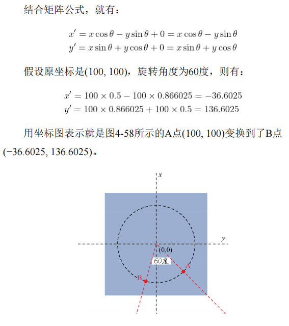

因此，元素旋转 60 度也可以使用下面的矩阵函数表示：

```css
transform: matrix(0.5, 0.866025, -0.866025, 0.5, 0, 0);
/* 等同于 */
transform: rotate(60deg);
```

### 4．斜切：skew()函数

斜切用到了三角函数 tan，对应的是 b 和 c 两个参数，需要注意的是 b 参数表示的是 轴的斜切，而后面的参数 c 才是 轴的斜切。计算公式如下：

```css
matrix(1, tan(θy), tan(θx), 1, 0, 0)
```

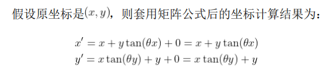

### 5．汇总说明

位移变换使用的是矩阵参数 e 和 f；  
缩放变换使用的是矩阵参数 a 和 d；  
旋转变换使用的是矩阵参数 a、b、c 和 d；  
斜切变换使用的是矩阵参数 b 和 c。

仔细查看上面的结论，不难发现同时使用不同的变换就会有参
数冲突的问题，假如想要同时使用旋转变换和缩放变换，各个参数
值该如何使用矩阵表示呢？使用空格分开表示即可，例如：

```css
transform: matrix(0.5, 0.866, -0.866, 0.5, 0, 0) matrix(3, 0, 0, 1, 0, 0);
```

可以看到，使用 matrix()函数表示实在太麻烦了，参数很多，还要计算和记忆。因此日常开发中我们使用的都是更加语义化的快捷函数，例如上面的矩阵表示实际上可以写作：

```css
transform: rotate(60deg) scale(3, 1);
```

但是，这并不表示 matrix()函数一无是处，举两个应用场景例子。

1. 跨语言的图形变换处理。矩阵的计算是各个语言通用的，在跨语言、跨设备处理的时候，matrix()函数就很有用。例如，在 Web 中呈现医学影像的图形，后台数据库存储的往往就是矩阵变换坐标，此时有了 matrix()函数，就可以直接呈现了。
2. 前面提到运行 transform: scale(.75)translateX(40px)最后元素的水平偏移大小是 30px，这让不少开发者“踩了坑”，如果使用 matrix()函数表示，就不会有这样的问题出现了：

```css
transform: matrix(0.75, 0, 0, 0.75, 40, 0);
```

### 6．3D 矩阵变换

最后，关于 3D 矩阵变换再多说一两句。3D 矩阵变换不再是 3×3，而是 4×4，其计算方式和 2D 变换一致，只是上升了 1 个维度，计算复杂度增加了。这里简单示意下 3D 缩放效果的矩阵计算公式，如图：

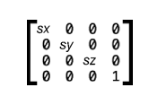

用代码表示就是：

```css
transform: matrix3d(sx, 0, 0, 0, 0, sy, 0, 0, 0, 0, sz, 0, 0, 0, 0, 1);
```

## 4.4.5 常常被遗忘的 transform-origin 属性

变换默认是相对于元素的中心点进行的，这个中心点是由 transform-origin 属性决定的。

在 IE9 浏览器中的 transform-origin 属性支持 2 个属性值，在 IE10+浏览器中则支持 3 个属性值，分别表示 x 轴、 y 轴和 z 轴的变换中心点，初始值是 50%、50%和 0，其中需要注意以下几点。

- z 轴只能是数值。
- x 轴和 y 轴支持百分比值、数值和关键字属性值（left |center | right | top | bottom）。
- 关键字属性值自带方位，因此 轴关键字写在前面也是正确的，例如：

  ```css
  /* x轴 | y轴 */
  transform-origin: right top;

  /* y轴 | x轴 */
  transform-origin: top right;
  ```

center 关键字可省略，例如：

```css
transform-origin: bottom center;
/* 可以写作 */
transform-origin: bottom;
```

同样，如果看到单个值语法，则另外一个省略的值就是 50%，例如

```css
transform-origin: 20px;
/* 等同于 */
transform-origin: 20px 50%;
```

transform-origin 属性在实际项目开发中主要用在下面两个场景。

1. 模拟现实世界物体的运动。例如，我以前做项目的时候实现过蜡烛火焰摆动的效果，该效果需要设置火焰元素的 transform-origin 属性值为 bottom，这样火焰摆动的时候才自然。又如实现钟摆运动的动画效果，需要设置 transform-origin 属性值为 top，这样钟摆顶部就会固定，下方会摆动。
2. 布局与定位。例如，在 Chrome 浏览器中想要实现 10px 大小的字符，可以先设置 12px 大小的字符，然后缩放一下：

   ```css
   .text {
     transform: scale(0.83333);
   }
   ```

但是这样做有一个问题，transform 变换的时候元素的原始位置是保留的，这会导致元素缩小后原本设定的间距变大，此时可以使用 transform-origin 属性优化一下。如果元素是左对齐的，则可以设置：

```css
transform-origin: left;
```

如果元素是右对齐的，则可以设置:

```css
transform-origin: right;
```

### transform-origin 属性作用原理

transform-origin 属性的作用原理就是改变 transform 变换的中心点坐标。transform 变换默认的中心点坐标为(0, 0)，如图:

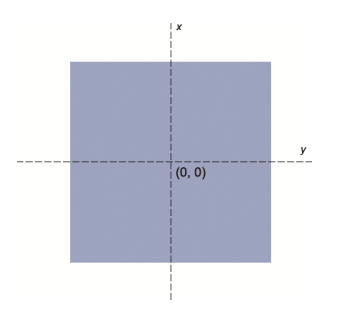

设置变换中心点位于左上角：

```css
transform-origin: 0 0;
```

现在的中心点坐标就不是(0, 0)了，而是(140, -145)（这是因为色块尺寸为 280px×290px）,如图：

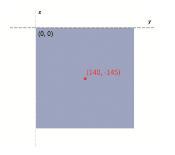

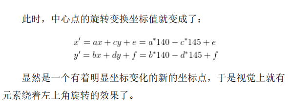

总结一下，所有 transform 变换本质上都是坐标点位置的矩阵变换，transform-origin 属性变化后，所有点的坐标都会发生变化，这导致最终的矩阵变换计算结果也发生变化。

## 4.4.6 scale()函数缩放和 zoom 属性缩放的区别

除了 Firefox 浏览器不支持 zoom 属性，其他所有浏览器都支持，且支持时间非常早，移动端也可以放心使用。zoom 属性的正式语法如下：

```css
zoom: normal | reset | <number> | <percentage>;
```

从语法中可以看出 zoom 属性支持以下属性值。

- 百分比值。zoom:50%，表示缩小到原来的一半。
- 数值。zoom:0.5，表示缩小到原来的一半。
- normal 关键字。zoom:normal 等同于 zoom:1，是默认值。
- reset 关键字。zoom:reset，表示用户按 Ctrl 和 − 或 Ctrl 和+进行文档缩放的时候，元素不跟着缩小与放大。不过，这个关键字兼容性很糟糕，仅被 Safari 浏览器支持

过对比 zoom 属性缩放和 scale()函数缩放的不同之
处:

1. 标准和非标准区别。zoom 属性是一个非标准属性，虽然 MDN 文档建议不要在非生产环境使用，但是根据我的判断，浏览器日后绝无可能放弃对 zoom 属性的支持。
2. 坐标系不同。zoom 属性缩放的中心坐标是相对于元素的左上角，且不能修改。transform 变换中的 scale()函数缩放默认的中心坐标是元素的中心点。
3. 占据的尺寸空间表现不同。zoom 属性缩放会实时改变元素占据的尺寸空间。例如，一个图片原始尺寸是 128px×96px，则应用下面的 CSS 代码后，图片占据的尺寸就会变成 256px×192px，该图片周围的元素会被推开，并会触发重绘和重计算，因此 zoom 属性缩放的性能比 scale()函数缩放的性能差。

   ```css
   img {
     zoom: 2;
   }
   ```

   如果图片使用的是 scale()函数缩放，则占据的尺寸还是原先的 128px×96px。

4. 元素应用 zoom 属性不会出现应用 transform 属性后的个变化。元素应用 zoom 属性不会创建层叠上下文，不会影响 fixed 元素的定位和 overflow 属性对绝对定位的溢出隐藏，也不会改变绝对定位元素的包含块

总而言之，zoom 属性就是一个普普通通的改变元素比例的 CSS 属性

## 4.4.7 了解全新的 translate、scale 和 rotate 属性

最新的 CSS Transforms Level 2 规范针对位移、缩放和旋转定义了全新的 CSS 属性。例如，位移可以直接使用 translate 属性，该属性支持 1 ～ 3 个值，分别表示 x 轴、 y 轴和 z 轴，语法如下：

```css
translate: 50%;
translate: 10px 20px;
translate: 50% 105px 5rem;
```

缩放可以直接使用 scale 属性，支持 1 ～ 3 个值，分别表示 x 轴、 y 轴和 z 轴，语法如下：

```css
scale: 1;
scale: 1 0.5;
scale: 1 2 3;
```

旋转可以直接使用 rotate 属性，语法相对复杂些：

```css
rotate: 45deg;
/* 指定旋转轴 */
rotate: x 90deg;
rotate: y 0.25turn;
rotate: z 1.57rad;
/* 矢量角度值 */
rotate: 1 1 1 90deg;
```

下面将逐一讲解上述语法中的元素：
rotate:45deg 等同于 transform:rotate(45deg)，是一
个 2D 旋转变换；  
rotate:x 90deg 等同于 transform:rotateX(90deg)；  
rotate:y .25turn 等同于 transform:rotateY(.25turn)；  
rotate:z 1.57rad 等同于 transform:rotateZ(1.57rad)；  
rotate:1 1 1 90deg 等同于 transform:rotate3D(1,
1, 1, 90deg)。

写下这段文字内容的时候,只有 Firefox 浏览器支持这个新特性，想要在实际项目中使用这个新特性，还需要一段时间，大家了解即可。最后，没有 skew 属性
