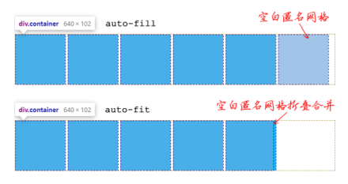

# 6.3 网格布局

给 HTML 元素设置 display:grid 或者 display:inline-grid，网格布局就创建完成了！例如：

```css
div {
  display: grid;
}
```

此时该 div 就是“grid 容器”，其子元素被称为“grid 子项”。

display:grid 和 display:inline-grid 的区别是：  
inline-grid 容器外部盒子保持内联特性，因此可以和图片文字在同一行显示；  
grid 容器保持块状特性，宽度默认为 100%，不和内联元素在一行显示。

在网格布局中，所有相关 CSS 属性可以分为两组，一组作用在 grid 容器上，还有一组作用在 grid 子项上，具体如下表：

| 作用在 grid 容器上    | 作用在 grid 子项上 |
| --------------------- | :----------------: |
| grid-template-columns | grid-column-start  |
| grid-template-rows    |  grid-column-end   |
| grid-template-areas   |   grid-row-start   |
| grid-template         |    grid-row-end    |
| grid-column-gap       |    grid-column     |
| grid-row-gap          |      grid-row      |
| grid-gap              |     grid-area      |
| justify-items         |    justify-self    |
| align-items           |     align-self     |
| place-items           |     place-self     |
| justify-content       |                    |
| align-content         |                    |
| place-content         |                    |
| grid-auto-columns     |                    |
| grid-auto-rows        |                    |
| grid-auto-flow        |                    |
| grid                  |                    |

## 6.3.1 grid-template-columns 和 grid-template-rows 属性简介

grid-template-columns 和 grid-template-rows 属性主要用来指定网格的数量和尺寸等信息

grid 布局：
:::demo

```vue
<template>
  <div class="container">
    <item>1</item>
    <item>2</item>
    <item>3</item>
    <item>4</item>
  </div>
</template>

<style lang="scss" scoped>
.container {
  display: grid;
}
</style>
```

:::

grid-template-columns 属性指定列的数量和尺寸：

```css
.container {
  grid-template-columns: 80px auto 100px;
  grid-template-rows: 25% 100px auto 60px;
}
```


- grid-template-columns 属性含 3 个值，表示网格分为 3 列，从左往右每列的尺寸分别是 80px、auto（自动）和 100px。
- grid-template-rows 属性含 4 个值，表示网格分为了 4 行，从上往下每行的高度分别是 25%、100px、auto（自动）和 60px。

可以通过使用缩写属性解决。例如，使用 grid-template 属性：

```css
.container {
  grid-template: 25% 100px auto 60px / 80px auto 100px;
}
```

甚至可以再短一点，直接使用 grid 属性：

```css
.container {
  grid: 25% 100px auto 60px / 80px auto 100px;
}
```

由于 grid-template-columns 属性和 grid-template-rows 属性语法一致，因此，接下来会选择 grid-template-columns 属性为代表进行讲解。

### 1．网格线的命名

grid-template-columns 属性有一个特别的功能，就是可以给网格线命名，语法如下：

```css
grid-template-columns: <line-name> <track-size> ...;
```

使用中文示意可以写作：

```css
grid-template-columns: <道路名称> <小区占地> ...;
```

- `track-size`表示划分出来的小区的尺寸，可以是长度值、
  百分比值、fr 单位（网格剩余空间比例单位）和尺寸关键字等
  多种类型的属性值。
- `line-name`表示划分的街道的名称，命名规则和 CSS 动画的
  命名规则一样。

上述语法用 CSS 代码示意就是：

```css
grid-template-columns:
  [道路名称-起始] 80px [道路名称2] auto [道路名
  称3] 100px [道路名称-结束];
```

给网格布局中的分隔线命名，目的就是更好地对区域进行描述。网格线命名主要用于 grid-column-start、grid-column-end、grid-row-start，grid-row-end 等属性，该功能作用在 grid 子项上，方便描述 grid 子项占据的网格区域

当然，如果我们没有描述某片区域的需求，自然也不需要命名了，因此，虽然给网格线命名看起来很新潮，但实际上使用场景有限且只有在语义非常明确的页面级的布局中才有必要使用，在常规的具体某个模块的布局中根本用不到。

另外，由于网格的中间区域的网格线是由两边格子公用的，因此，我们给网格线起名字的时候可以起两个名称（使用空格分隔），分别表示网格线的两侧。例如：

```css
.container {
  grid-template-columns:
    [广告区-左] 120px [广告区-右 内容区-左]
    600px [内容区-右];
}
```

### 2．聊聊 track-size

grid-template-columns 属性支持的其他值全都属于`track-size`数据类型，共支持 9 种数据类型，分别如下：

- 长度值；
- 百分比值；
- 关键字属性值，包括 min-content、max-content 和 auto；
- flex 数据类型，也就是以 fr 为单位的值；
- 函数值，包括 repeat()、minmax()和 fit-content()。

#### (1) min-content

:::demo

```vue
<template>
  <div class="grid1">
    <item>css</item>
    <item></item>
    <item>css_world</item>
    <item></item>
    <item>css_new_world</item>
    <item></item>
  </div>
</template>

<style lang="scss" scoped>
.grid1 {
  display: grid;
  grid-template-columns: max-content auto;
}
</style>
```

:::

#### (2) max-content

max-content 关键字和 min-content 关键字类似，只是最终的尺寸是最大内容宽度中最大的那一个值

#### (3) auto

auto 关键字的计算规则有些复杂，W3C 规范中是这样描述的：
尺寸的上限是最大内容尺寸的最大值，但是不同于 max-content 关
键字，max-content 关键字的尺寸是固定的，这里的尺寸是会受到
justify-content 属性和 align-content 属性影响的。例如有
如下 HTML：

```html
<div class="container">
  <item>内容</item>
  <item>很多内容</item>
  <item>内容</item>
  <item>很多内容</item>
</div>
```

同时有两段 CSS 代码应用在上述 HTML 代码上，区别就在于两者
设置的 justify- content 属性值不同，CSS 代码如下：

```css
.container {
  display: grid;
  grid-template-columns: auto auto;
  /* 拉伸，默认值 */
  justify-content: stretch;
}
.container {
  display: grid;
  grid-template-columns: auto auto;
  /* 两端对齐 */
  justify-content: space-between;
}
```


## 6.3.2 了解网格布局专用单位 fr

fr 是单词 fraction 的缩写，表示分数。

是这样的，网格布局往往有多列或者多行，其中有些列有固定的宽度，有些列的宽度就由页面自动分配，而 fr 就表示这些自动分配列的尺寸划分比例。

auto 关键字也可以自动分配列的尺寸，但是 auto 关键字的尺寸划分是随着内容变化的，内容多则尺寸大，内容少则尺寸小，而 fr 就是纯粹按比例计算，与内容多少无关。

fr 单位值的计算规则如下：

- 如果所有 fr 值之和大于 1，则按 fr 值的比例划分可自动分配尺寸
- 如果所有 fr 值之和小于 1，最终的尺寸是可自动分配尺寸和 fr 值的乘法计算值

### 1．所有列都使用 fr

```css
.container {
  grid-template-columns: 1fr 1fr 1fr;
}
```

此时 fr 值的和是 3，大于 1，因此按照比例划分，比例是 1:1:1


```css
.container {
  grid-template-columns: 0.2fr 0.2fr 0.2fr;
}
```

虽然 fr 值的比例还是 1:1:1，但是由于 fr 值的和是 0.6，小于 1，因此网格的宽度是容器尺寸和 0.2 的乘法计算值，会有 40%的尺寸是没有网格元素的


### 2．部分列是固定长度值

如果部分列是固定长度值，那么可自动分配尺寸就是容器尺寸减去固定的尺寸

```css
.container {
  grid-template-columns: 200px 1fr 1fr 1fr;
}
```


### 3．和 auto 关键字混合使用

如果部分列使用的是 auto 关键字，则 fr 值的计算规则就与设置 auto 这一列的内容密切相关。先看一个 fr 值之和大于 1 的例子

```css
.container {
  grid-template-columns: auto 1fr 1fr 1fr;
}
```


如果 fr 值之和小于 1，例如

```css
.container {
  grid-template-columns: auto 0.25fr 0.25fr 0.25fr;
}
```


## 6.3.3 详细介绍 minmax()和 fit-content()函数

### 1．minmax()函数

minmax()函数支持两个参数值，例如：

```css
minmax(min, max)
```

表示尺寸范围限制在 min ～ max 范围内。

minmax()函数的正式语法如下：

```css
minmax( [ <length> | <percentage> | min-content | max-content |
auto ] , [ <length> | <percentage> | <flex> | min-content | max-content | auto ] )
```

其中有一个细节需要注意一下，`flex`数据类型（如以 fr 为单位的值）只能作为第二个参数出现

以下这些用法则是正确的：

```css
/* 正确 */
minmax(200px, 1fr)
minmax(400px, 50%)
minmax(30%, 300px)
minmax(100px, max-content)
minmax(min-content, 400px)
minmax(max-content, auto)
minmax(auto, 300px)
```

网格布局的尺寸本身就是弹性的，如果再使用 minmax()函数，则不同宽度设备下的尺寸变化会更智能，会有种变魔术的感觉，这个 CSS 函数值得学习

### 2．fit-content()函数

fit-content()函数的作用用一句话解释就是：让尺寸适应于内容，但不超过设定的尺寸。底层计算公式如下：

```css
fit-content(limit) = max(minimum, min(limit, max-content))
```

其中，minimum 是尺寸下限，如果不考虑 min-width/min-height 属性，这个尺寸就是最小内容尺寸。

为了方便理解，我们索性放弃考虑 min-width/min-height 属性，于是参数 minimum 可以替换成 min-content，也就有了下面的“不算精确的”公式：

```css
fit-content(limit) = max(min-content, min(limit, max-content))
```

这就表示最终的尺寸大于 min-content，小于设定尺寸（即 limit）和 max-content 的较小值。换句话说，fit-content()函数实现的效果是：尺寸由内容决定，内容越多尺寸越大，但不超
过限定的尺寸。例如：

```html
<div class="container">
  <item>内容少</item>
  <item>内容很多，多到足够换行</item>
  <item>40px</item>
  <item>auto</item>
</div>
<style>
  .container {
    display: grid;
    grid-template-columns:
      fit-content(100px)
      fit-content(100px) 40px auto;
  }
  item {
    outline: 1px dashed;
  }
</style>
```

- 第一列文字内容很少，由于都是中文，因此，min-content 尺寸是一个中文尺寸。假设字体是宋体，则尺寸是 16px，而 max-content 尺寸是“内容少”这 3 个字的尺寸，为 48px。因此，最终尺寸是 48px，计算过程如下：

```css
fit-content(100px) = max(16px, min(100px, 48px)) = 48px
```

- 第二列文字内容较多，由于包含避头标点逗号，因此，min-content 尺寸是 2 个中文尺寸。假设字体是宋体，则尺寸是 32px，而 max-content 尺寸是全部文字的尺寸，为 176px。因此，最终尺寸是 100px，计算过程如下：

```css
fit-content(100px) = max(32px, min(100px, 176px)) = 100px
```


这就是 fit-content()函数的作用，常用于希望 grid 子项的宽度随着内容变化，但是又不希望宽度太大的场景。

fit-content()函数的正式语法如下：

```css
fit-content( [ <length> | <percentage> ] )
```

也就是说，fit-content()函数只支持数值和百分比值，fr 值是不正确的。

## 6.3.4 repeat()函数的详细介绍

### 1．repeat()函数的作用

先看下面的代码：

```css
.container {
  grid-template-columns: 40px auto 60px;
}
```

这段代码表示网格布局分为 3 列，每列的宽度分别是 40px、auto 和 60px。

再看下面的代码：

```css
.container {
  grid-template-columns: 40px auto 60px 40px auto 60px;
}
```

这段代码表示布局分为 6 列，每列的宽度分别是 40px、auto、60px、40px、auto 和 60px。

repeat()函数的价值就体现出来了。请看：

```css
.container {
  grid-template-columns: repeat(4, 40px auto 60px);
}
```

这段代码非常好理解，重复 4 次，每次的重复单元是 40px auto60px 这 3 个尺寸


由此可见，repeat()函数的作用很简单，就是当网格尺寸可以重复的时候简化属性值的书写，正式语法如下：

```css
repeat( [ <positive-integer> | auto-fill | auto-fit ] , <track-list> )
```

其中，`track-list`就是不包括 repeat()函数在内的所有 grid-template-columns 支持的属性值，包括 fr 值和 min-content/max-content 关键字，以及 minmax()函数和 fit-content()函数等。因此，下面这些语法都是正确的：

```css
/* 正确 */
repeat(4, 1fr)
repeat(4, [col-start] 250px [col-end])
repeat(4, [col-start] 60% [col-end])
repeat(4, [col-start] 1fr [col-end])
repeat(4, [col-start] min-content [col-end])
repeat(4, [col-start] max-content [col-end])
repeat(4, [col-start] auto [col-end])
repeat(4, [col-start] minmax(100px, 1fr) [col-end])
repeat(4, [col-start] fit-content(200px) [col-end])
repeat(4, 10px [col-start] 30% [col-middle] auto [col-end])
repeat(4, [col-start] min-content [col-middle] max-content [col-end])
```

- `positive-integer`，顾名思义，就是正整数的意思，表示尺寸重复的次数
- 有时候，我们无法确定网格布局的列数，例如希望网格布局的列数随着容器宽度变化，这个时候就不能将重复次数设置为固定的整数值，而应该使用 `auto-fill` 关键字或 `auto-fit` 关键字代替

### 2．auto-fill 关键字

假设有 5 个 grid 子项，HTML 代码如下：

```html
<div class="container">
  <item></item>
  <item></item>
  <item></item>
  <item></item>
  <item></item>
</div>
<style>
  .container {
    grid-template-columns: repeat(auto-fill, 100px);
  }
</style>
```

- 如果 grid 容器宽度是 640px，可以放下 6 个 100px 宽的 grid 子项，则此时 auto-fill 关键字值等同于 6。只不过，由于这里 grid 子项元素（`item`元素）只有 5 个，因此还有一个 grid 子项是空白的。


- 如果 grid 容器宽度是 375px，最多每行可以放下 3 个 100px 宽的 grid 子项，则此时 auto-fill 关键字值等同于 3。


在实际开发的时候，我们不会期望出现上图所示的效果，因为右侧留有严重影响视觉体验的不对称的空白区域，所以，auto-fill 关键字往往会和其他网格布局函数一起使用，例如 minmax()函数，示例如下：

```css
.container {
  grid-template-columns: repeat(auto-fill, minmax(100px, 1fr));
}
```

这就实现了无论 grid 容器多宽，grid 子项都会等比例充满 grid 容器（因为设置了 1fr），同时保证宽度不小于 100px，网格布局的列数自动计算分配的智能弹性布局效果。例如，当 grid 容器宽度是 375px 时的布局效果如图


### 3．auto-fit 关键字

auto-fit 和 auto-fill 关键字的作用是相似的，区别在于 auto-fit 关键字会把空白匿名网格进行折叠合并，而这个合并的 0px 大小的格子可以被认为具有单个格子轨道大小调整的功能，同时，空白匿名格子两侧的过道（grid-gap 设置的间隙）也会合并。

什么意思呢？这个需要对比 auto-fill 关键字才容易理解。

```css
.container {
  grid-template-columns: repeat(auto-fill, 100px);
}
.container {
  grid-template-columns: repeat(auto-fit, 100px);
}
```



可以看到，auto-fit 关键字把空白匿名网格连同左侧的间隙也一起合并了。这种合并设计有什么好处呢？好处就在于，如果配合 fr 值一起使用，可以保证无论 grid 容器宽度多大，grid 子项都可以填满 grid 容器。例如：

[demo](https://demo.cssworld.cn/new/6/3-2.php)

### 4．一些小细节和兼容性

repeat()函数只能作用在 grid-template-columns 和 grid-template -rows 这两个 CSS 属性上。

在 Firefox 浏览器中，grid-template-rows 属性对 repeat()函数仅仅是部分支持，不支持的是 auto-fill 和 auto-fit 这两个关键字参数，grid-template-columns 属性对 repeat()函数则是完全支持的。

repeat()函数的兼容性如表所示。


## 6.3.5 了解 grid-template-areas 属性

grid-template-areas 属性用来指定网格区域的划分，注意是 areas，不是 area，后面有个 s。网格区域的划分性质和城市的行政区划分、小区的划分、农田的划分都很接近，划分网格区域可以更方便网格的管理与维护。

grid-template-areas 属性的语法如下：

```css
.container {
  grid-template-areas:
    '<grid-area-name> | . | none | ...'
    '...';
}
```

- `grid-area-name`表示对应网格区域的名称，命名规则和 animation-name 属性值一样。
- .表示空的网格单元格。例如

```css
grid-template-areas:
  'a a .'
  '. b c';
```

就表示第一行第三列和第二行第一列的网格是一个空的单元格。

- none 表示没有定义网格区域。

我们通过一个案例熟悉一下 grid-template-areas 属性的使用方法和作用。张老板承包了一块土地，希望开展农作物种植和水产养殖业务，那么就需要对这块土地进行区域划分，决定哪片区域搞种植，哪片区域搞养殖。于是张老板就把这片土地划分成了 3×4 共 12 个小格子，最上面 3 个格子种葡萄，最下面 3 个格子种西瓜，中间 6 个格子，左边 2 个养龙虾，右边 4 个养鱼。土地区域划分如图所示。


[demo](https://demo.cssworld.cn/new/6/3-3.php)

## 6.3.6 缩写属性 grid-template

grid-template 属性是 grid-template-rows、grid-template-columns 和 grid-template-areas 属性的缩写。语法示意如下：

```css
.container {
  grid-template: none;
}
.container {
  grid-template: <grid-template-rows> / <grid-template-columns>;
}
.container {
  grid-template: [ <line-names>? <string> <track-size>? <line-names>? ] + [ / <explicit-track-list> ]?;
}
```

- 属性值 none 表示将 3 个 CSS 属性都设置为初始值 none。
- `grid-template-rows` / `grid-template-columns`表示行尺寸或列尺寸的设置，例如：

```css
grid-template: 100px 1fr / 50px 1fr;
grid-template: auto 1fr / auto [col-name1] 1fr [col-name2] auto;
```

- 第三种缩写是包含 grid-template-areas 属性的语法，其中`string`指的就是 grid-template-areas 属性值，更准确地说是每一行网格的区域名称。

例如，前面张老板土地划分例子的完整代码用 grid-template 缩写属性表示就是下面这样

```css
.container {
  grid-template:
    '葡萄 葡萄 葡萄' 1fr
    '龙虾 养鱼 养鱼' 1fr
    '龙虾 养鱼 养鱼' 1fr
    '西瓜 西瓜 西瓜' 1fr
    / 1fr 1fr 1fr;
}
```

上面的代码也可以写成一行，如下所示：

```css
.container {
  grid-template: '葡萄 葡萄 葡萄' 1fr '龙虾 养鱼 养鱼' 1fr '龙虾 养 鱼 养鱼' 1fr '西瓜 西瓜 西瓜' 1fr / 1fr 1fr 1fr;
}
```

只是这代码可读性太差了，因此，在实际开发中，我们会约定
俗成地把每一行网格的区域名称、尺寸等放在一行显示。

## 6.3.7 了解 grid-auto-columns 和 grid-auto-rows 属性

grid-auto-columns 和 grid-auto-rows 属性的作用是指定任何自动生成的网格（也称为隐式网格）的尺寸大小。

这里需要了解网格布局中“隐式网格”和“显式网格”这两个概念，“隐式网格”是非正常网格，其在 grid 子项多于设置的单元格数量，或 grid 子项的位置出现在设定的网格范围之外时出现，而在规定容器内显示的网格称为“显式网格

举个例子，下面的 CSS 代码指定了一个 2×2 的网格：

```css
.container {
  grid-template: 1fr 1fr / 1fr 1fr;
}
```

但是 flex 子项却有 5 项，具体如下：

```html
<div class="container">
  <item>1</item>
  <item>2</item>
  <item>3</item>
  <item>4</item>
  <item>5</item>
</div>
```

此时，第五个`item`元素就是“隐式网格”。

grid-auto-columns 属性和 grid-auto-rows 属性就是用来控制“隐式网格”的尺寸的。例如：

```css
.container {
  display: grid;
  grid-template: 1fr 1fr / 1fr 1fr;
  /* 隐式网格高度是60px */
  grid-auto-rows: 60px;
}
```

第五个\<item>元素的高度为 60px，而其他显式网格（第一到第四个\<item>元素）的高度依然表现为 auto。


再举一个 grid 子项的位置出现在设定的网格范围之外的例子，HTML 和 CSS 代码如下：

```html
<div class="container">
  <item class="item-a">a</item>
  <item class="item-b">b</item>
</div>
<style>
  .container {
    display: grid;
    grid-template: 1fr 1fr / 1fr 1fr;
    /* 隐式网格宽度是60px */
    grid-auto-columns: 60px;
  }
  .item-b {
    /* 只有2列尺寸设置，但这里列范围大于2，隐式网格创建 */
    grid-column: 3 / 4;
    background-color: rgba(255, 255, 0, 0.5);
  }
</style>
```

.item-b 元素的 grid-column 属性值范围是第三网格线到第四网格线，超过 grid-template 属性设置的 2 列网格范围，因此.item-b 元素是一个隐式网格，其宽度是 60px


grid-auto-columns 属性和 grid-auto-rows 属性的语法如下：

```css
.container {
  grid-auto-columns: <track-size>...;
  grid-auto-rows: <track-size>...;
}
```

其中，\<track-size>表示隐式网格的尺寸大小。这两个属性的默认值是 auto，可以是长度值、百分比值和 fr 值，也可以是 min-content 关键字和 max-content 关键字，也支持 mimmax() 函数和 fit-content()函数，但是不支持 repeat()函数。

## 6.3.8 深入了解 grid-auto-flow 属性

grid-auto-flow 属性用来定义子项目元素的自动流动状态，grid-auto-flow 属性在网格布局中的地位非常类似于弹性布局中的 flex-direction 属性。

grid-auto-flow 属性语法如下：

```css
grid-auto-flow: [ row | column ] || dense;
```

因此，下面这些写法都是正确的：

```css
grid-auto-flow: row;
grid-auto-flow: column;
grid-auto-flow: dense;
grid-auto-flow: row dense;
grid-auto-flow: column dense;
```

- row 是默认值，表示没有指定位置的网格在水平（行）方向上自然排列。
- column 表示没有指定位置的网格在垂直（列）方向上自然排列。
- dense 表示网格的自然排列启用“密集”打包算法，也就是说，如果稍后出现的网格比较小，则尝试看看其前面有没有合适的地方放置该网格，使网格尽可能排列紧凑

网格布局中的网格总是表现为：grid 子项从第一行开始，从左往右依次填入网格格子，全部格子填满后，继续转到下一行，从左往右再次填满格子。例如：

```html
<div class="container">
  <item>格子1</item>
  <item>格子2</item>
  <item>格子3</item>
  <item>格子4</item>
  <item>格子5</item>
  <item>格子6</item>
  <item>格子7</item>
  <item>格子8</item>
  <item>格子9</item>
</div>
<style>
  .container {
    display: grid;
    grid-template-columns: 1fr 1fr;
    line-height: 40px;
  }
</style>
```


很多前端开发者并没有意识到，这种优先水平排列的布局现象并不是理所当然的，也不是一成不变的，因为这种布局表现的底层是由 grid-auto-flow 属性控制的。因为 grid-auto-flow 属性的默认值是 row，所以才优先水平排列。如果我们将 grid-auto-flow 的属性值修改为 column：

```css
.container {
  display: grid;
  grid-template-rows: 1fr 1fr;
  grid-auto-flow: column;
  line-height: 40px;
}
```


[demo](https://demo.cssworld.cn/new/6/3-4.php)

dense 关键字

首先，让前面的 grid 格子留空，人为制造出稀疏布局结构，CSS 代码如下：

```css
.container {
  display: grid;
  grid-template-columns: 1fr 1fr;
}
.container item:first-child {
  grid-column-start: 2;
}
```


如果我们希望第一个格子被充分利用，让整个排列是紧密相连的，则可以使用 dense 关键字属性值。

```css
.container {
  display: grid;
  grid-template-columns: 1fr 1fr;
  grid-auto-flow: dense;
}
.container item:first-child {
  grid-column-start: 2;
}
```


## 6.3.9 缩写属性 grid

熟练使用 grid 缩写属性，是掌握网格布局的重要标志之一。

grid 属性的缩写规则比较复杂。grid 是这些 CSS 属性的缩写集合：grid-template- rows、grid-template-columns、grid-template-areas、grid-auto-rows、grid- auto-columns 和 grid-auto-flow。grid 缩写根据语法分为以下四大类。

### 1．grid: none

```css
grid: none;
```

none 表示设置所有子属性为初始值。

### 2．grid: \<grid-template>

grid: \<grid-template>和 grid-template 的缩写语法一模一样，这一点在前面有详细介绍，这里不再赘述，只举个很常用的例子说明一下：

```css
.container {
  grid: 100px 300px / 3fr 1fr;
}
```

等同于下面：

```css
.container {
  grid-template-rows: 100px 300px;
  grid-template-columns: 3fr 1fr;
}
```

### 3．auto-flow 在后面

第三种和第四种缩写语法需要用到 auto-flow 关键字，auto-flow 关键字是一个只在 grid 缩写属性中出现的关键字，本质上是一个变量关键字。

还是先看一下正式语法：

```css
grid: <grid-template-rows> / [ auto-flow && dense? ] <grid-auto-columns>?;
```

其中，\<grid-template-rows>就是 grid-template-rows 属性的值，也就是每一行的高度尺寸和网格线命名等信息；\<grid-auto-columns>就是 grid-auto-columns 属性的值，也就是隐式网格的宽度大小。

由于\<grid-template-rows>后面有个问号，表示 0 或 1，即可有可无的意思，因此，grid- auto-columns 属性的值是可以省略的，省略时会将 grid-auto-columns 属性的值解析为 auto。

下面重点讲一下 auto-flow && dense?的含义。

实际上，auto-flow && dense?就是 grid-auto-flow 属性的值，等同于 row、column、row dense 或 column dense。也就是关键字 auto-flow 既可以表示关键字 row，又可以表示关键字 column，就像是 row 和 column 这两个关键字的变量关键字。

这样一来就有下面两个疑问。

- auto-flow 关键字在什么时候解析成 row 关键字，又在什么时候解析成 column 关键字呢？
- 为什么这么设计，直接使用 row 关键字和 column 关键字表示不行吗？

auto-flow 关键字究竟是解析成 row 关键字还是解析成 column 关键字，是根据 auto-flow 关键字是在斜杠的左侧还是右侧决定的。如果 auto-flow 关键字在斜杠左侧，则解析为 row 关键字；如果在斜杠右侧，则解析为 column 关键字。因为在网格布局的缩写属性中，斜杠左侧的都表示行控制，斜杠右侧的都表示列控制

然后回答第二个问题，设计关键字 auto-flow 的作用。这样设计的作用是避免出错，例如，假设没有 auto-flow 关键字，很可能就会写出这样的 CSS 代码

```css
.container {
  grid: 100px 300px / row 200px;
}
```

把 row 关键字写到斜杠的后面去了，导致语法错误。使用 auto-flow 关键字就不用关心到底斜杠前面是 row 关键字还是斜杠后面是 row 关键字了。

下面通过一个案例学习一下这种语法：

```css
.container {
  grid: 100px 300px / auto-flow 200px;
}
```

这里 auto-flow 关键字是在斜杠的右侧，因此会将 auto-flow 关键字解析为 column。上面 CSS 代码省略了 dense 关键字，启用了\<grid-auto-columns>，因此，等同于下面的 CSS 代码：

```css
.container {
  grid-template-rows: 100px 300px;
  grid-auto-flow: column;
  grid-auto-columns: 200px;
}
```

### 4．auto-flow 在前面

正式语法如下：

```css
grid: [ auto-flow && dense? ] <grid-auto-rows>? / <grid-template-columns>;
```

此语法和 auto-flow 关键字在后面的语法类似，只是这里的语法表示斜杠前面是隐式网格，后面是显式网格。在这里，由于 auto-flow 关键字在斜杠左侧，因此解析为 row 关键字。所以：

```css
.container {
  grid: auto-flow dense 100px / 1fr 2fr;
}
```

等同于下面 CSS：

```css
.container {
  grid-auto-flow: row dense;
  grid-auto-rows: 100px;
  grid-template-columns: 1fr 2fr;
}
```

- grid:none 很简单，没什么好说的。
- 如果没有隐式网格，且无须改变网格布局的自然流向，则使用 grid-template 属性。
- 最后两个语法是在出现隐式网格，或者需要改变网格布局的自然流向的时候使用，要么使用 grid-template/auto-flow，要么使用 auto-flow/grid-template，就这么简单。

## 6.3.10 间隙设置属性 column-gap 和 row-gap（grid- column-gap 和 grid- row-gap）

以前是使用 grid-column-gap 属性和 grid-row-gap 属性来对网格布局中各个网格之间的间隙进行设置的，后来，随着 CSS Box Alignment Module Level 3 的制定，无论是分栏布局、弹性布局还是网格布局，全部统一使用 column-gap 属性和 row-gap 属性来设置。

以 column-gap 属性举例，各大布局兼容性排序如下：

分栏布局 > 网格布局 > 弹性布局

各个布局的浏览器兼容性如下。

- 分栏布局中，column-gap 属性在 IE10+浏览器中全兼容。
- 网格布局中，column-gap 属性在 Edge16+浏览器中都提供支持。
- 弹性布局中，column-gap 属性目前仅有 Chrome 浏览器和 Firefox 浏览器提供不错的支持。

row-gap 属性的兼容性也类似，只是分栏布局中没有行的概念，因此，使用 row-gap 属性没有效果。

目前在这三大布局中，column-gap 属性和 row-gap 属性在网格布局中的支持最完整。虽然目前浏览器依然支持 grid-column-gap 属性和 grid-row-gap 属性，但是保不准日后会被舍弃，因此在网格布局中，推荐使用 column-gap 属性和 row-gap 属性。语法如下：

```css
.container {
  column-gap: <line-size>;
  row-gap: <line-size>;
}
```

其中，\<line-size>是网格间的间隙尺寸，可以是长度值，也
可以是百分比值。下面的语句都是正确的：

```css
row-gap: 20px;
row-gap: 1em;
row-gap: 3vmin;
row-gap: 10%;
row-column: 15px;
row-column: 1rem;
row-column: 3vmax;
row-gap: 15%;
```

用实例说话，给定一个简单的 2×2 网格，设置水平间隙（列间隙）为 20px，垂直间隙（行间隙）为 10px，如下所示：

```css
.container {
  display: grid;
  height: 150px;
  grid: 1fr 2fr / 2fr 1fr;
  /* 列间隙20px，行间隙10px */
  column-gap: 20px;
  row-gap: 10px;
}
```


## 6.3.11 缩写属性 gap（grid-gap）

在网格布局中，gap 属性的前身是 grid-gap 属性，这里推荐使用 gap 属性，grid-gap 属性已经确定被替换了。gap 属性的语法如下：

```css
.container {
  gap: <row-gap> <column-gap>;
}
```

和其他网格布局中的 CSS 属性一样，表示行的部分写在前面，表示列的部分写在后面。例如，CSS 代码：

```css
.container {
  display: grid;
  grid: 1fr 2fr / 2fr 1fr;
  column-gap: 20px;
  row-gap: 10px;
}
```

可以缩写成：

```css
.container {
  display: grid;
  grid: 1fr 2fr / 2fr 1fr;
  gap: 10px 20px;
}
```

如果 gap 属性值只有 1 个值，则表示行间隙和列间隙同时设置为这个值。例如，CSS 代码：

```css
gap: 20px;

/* 等同于： */
gap: 20px 20px;
```

gap 属性值支持数值和百分比值，也支持 calc()函数，因此下面这些用法都是正确的：

```css
/* 正确 */
gap: 20px;
gap: 1rem;
gap: 3vmin;
gap: 16%;
gap: 100%;
gap: 20px 10px;
gap: 1em 0.5em;
gap: 3vmin 2vmax;
gap: 16% 100%;
gap: 21px 82%;
gap: calc(10% + 20px);
gap: calc(20px + 10%) calc(10% - 5px);
```

## 6.3.12 元素对齐属性 justify-items 和 align-items

justify-items 属性用来定义元素在网格中的水平对齐表现，align-items 属性则是用来定义元素在网格中的垂直对齐表现

### 1．justify-items

justify-items 的常用语法如下：

```css
.container {
  justify-items: stretch | start | end | center;
}
```

- stretch 表现为元素水平尺寸拉伸，填满整个网格的水平空间。
- start 表现为元素的水平尺寸收缩为内容大小，同时沿着网格线左侧对齐显示，效果如图所示，可以看到元素所在网格的背景和轮廓范围在水平方向收缩了，同时元素在网格线的左侧对齐显示了。


- end 表现为元素的水平尺寸收缩为内容大小，同时沿着网格线右侧对齐显示


- center 表现为元素的水平尺寸收缩为内容大小，同时在当前网格区域内部水平居中对齐显示，效果如图所示。其中图左侧是实际显示效果，图右侧是网格线显示后的效果，可以看到元素尺寸水平收缩，同时在网格中居中对齐显示


### 2．align-items

align-items 属性的表现和 justify-items 属性类似，区别就在于方向不同

```css
.container {
  align-items: normal | stretch | start | end | center | baseline;
}
```

- normal 是默认值，会根据使用场景的不同表现为 stretch 或 者 start。
- stretch 表现为元素的尺寸在垂直方向进行拉伸，以填满整个网格的垂直空间。
- start 表现为元素的垂直尺寸收缩为内容大小，同时沿着上网格线对齐显示


- end 表现为元素的垂直尺寸收缩为内容大小，同时沿着下网格线对齐显示


- center 表现为元素的垂直尺寸收缩为内容大小，同时在当前网格区域内部垂直居中对齐显示


- baseline 表现为每一行的各个 grid 子项沿着基线对齐。如果某一项都是块级元素，没有基线，则在 Firefox 浏览器中的对齐会失败；而在 Chrome 浏览器中，grid 子项的底边缘会作为基线，依然会有基线对齐效果。因此，如果项目需要兼容 Firefox 浏览器，务必要保证 grid 子项中都有内联元素

图所示是应用 baseline 属性值后的对齐效果，可以看到按钮的对齐基线是第一行文字内容，说明 baseline 属性值的效果等同于 first baseline。


[相关 demo](https://demo.cssworld.cn/new/6/3-5.php)

`align-items:normal`

在网格布局中，在绝大多数场景下 normal 的表现和 stretch 的表现是一模一样的，但是如果 grid 子项是具有内在尺寸或具有内在比例的元素，则此时 normal 的表现类似于 start 属性值的表现。

[align-items:normal demo](https://demo.cssworld.cn/new/6/3-6.php)

- 图片的默认表现确实是 start
- 按钮的默认表现确实是 stretch

## 6.3.13 缩写属性 place-items

使用 place-items 属性可以让 align-items 和 justify-items 属性写在单个声明中。语法如下：

```css
place-items: <align-items> <justify-items>?;
```

垂直对齐写在前面，水平对齐写在后面，不过这种缩写顺序只适合 CSS 对齐属性，网格布局相关属性还是行在前、列在后。使用示意如下：

```css
place-items: center end;
place-items: space-between space-evenly;
place-items: first baseline legacy right;
```

根据 MDN 文档的数据，IE 浏览器和 Edge 浏览器都不支持 place-items 属性。如果不考虑浏览器的兼容性，在 CSS 中实现垂直居中对齐效果的最佳方法就是使用 place-items 属性：

```css
.container {
  display: grid;
  place-items: center;
}
```

## 6.3.14 整体对齐属性 justify-content 和 align- content

justify-content 属性和 align-content 属性分别指定了网格元素整体水平方向和垂直方向上的分布对齐方式

要想 justify-content 属性和 align-content 属性起作用，就需要让 grid 子项的总尺寸小于 grid 容器的尺寸。要么给 gird 子项设置较小的具体的尺寸值，要么让 gird 子项的尺寸是 auto，同时保证内容尺寸较小。例如：

```css
.container {
  display: grid;
  width: 240px;
  height: 240px;
  grid-template: 100px 100px / 100px 100px;
}
```

水平和垂直方向都有 40px 的剩余空间，此时的 justify-content 属性和 align-content 属性就有用武之地了。又或者：

```css
.container {
  display: grid;
  width: 240px;
  height: 240px;
  grid-template: auto auto / auto auto;
}
```

常用语法如下：

```css
justify-content: normal | stretch | start | end | center | space-between |
  space-around | space-evenly;
align-content: normal | stretch | start | end | center | space-between |
  space-around | space-evenly;
```

- normal 是默认值，效果和 stretch 一样
- stretch 可以看成 justify-content 属性和 align-content 属性的默认值，表示拉伸，表现为尺寸填满 grid 容器。拉伸效果需要在网格目标尺寸设为 auto 的时候才有效，如果固定了宽高，则无法拉伸
- start 是逻辑 CSS 属性值，与文档流方向相关。水平方向上默认表现为左对齐，垂直方向上默认表现为顶对齐
- end 是逻辑 CSS 属性值，与文档流方向相关。水平方向上默认表现为右对齐，垂直方向上默认表现为底对齐
- center 表现为水平居中对齐或垂直居中对齐
- space-between 表现为 grid 子项两端对齐，中间剩余空间等分
- space-around 表现为每个 grid 子项的上下或左右两侧都环绕互不干扰的相同尺寸的空白间距，在视觉上表现为 grid 子项边缘处的空白尺寸只有中间空白尺寸的一半
- space-evenly 表现为每个 grid 子项上下或左右两侧的空白间距完全相等

[相关 demo](https://demo.cssworld.cn/new/6/3-7.php)

## 6.3.15 缩写属性 place-content

使用 place-content 属性可以让 align-content 属性和 justify-content 属性写在同一个 CSS 声明中，也就是缩写。语法如下：

```css
place-content: <align-content> <justify-content>?;
```

使用示意如下：

```css
place-content: start center;
place-content: space-between space-evenly;
place-content: first baseline end;
```

## 6.3.16 区间范围设置属性 grid-column-start/grid-column-end 和 grid-row-start/grid-row-end

列范围设置属性 grid-column-start/grid-column-end 和行范围设置属性 grid- row-start/grid-row-end 是应用在 grid 子项上的，通过指定 grid 子项行和列的起止位置来表明当前 grid 子项所占据的范围。这几个属性的语法如下：

```css
.item {
  grid-column-start: <integer> | <name> | <integer> <name> | span <number> |
    span <name> | auto;
  grid-column-end: <integer> | <name> | <integer> <name>| span <number> | span
    <name> | auto;
  grid-row-start: <integer> | <name> | <integer> <name>| span <number> | span
    <name> | auto;
  grid-row-end: <integer> | <name> | <integer> <name>| span <number> | span
    <name> | auto;
}
```

- \<integer>指起止于第几条网格线，可以是负整数，但是不能是 0，负整数表示从右侧开始计数网格线。例如：

```css
.container {
  display: grid;
  grid: auto / repeat(6, 1fr);
}
.item {
  grid-column-start: -3;
  grid-column-end: 2;
  /* 设置背景色 */
  background: deepskyblue;
}
```

表示.item 元素区间起始于从右边缘往左数第三条线（包括边缘线），终止于从左边缘往右数的第二条线（包括边缘线），于是最终 grid 子项占据了第二至第四个显式网格


- \<name>是自定义的网格线的名称。需要注意的是，这里的名称有一个自动补全-start 后缀和-end 后缀的特性，这是什么意思呢？以下面的 CSS 代码为例：

```css
.container {
  display: grid;
  grid-template-columns:
    [A-start] 100px [A-end B-start] auto
    [B-end] auto;
}
```

此时，使用下面的代码指定.item 元素列的区间是可以找到对应的网格线的：

```css
.item {
  grid-column-start: A;
  grid-column-end: B;
  /* 设置背景颜色 */
  background: deepskyblue;
}
```

虽然 grid-column-start 的值是 A，但是，浏览器在找不到名称为 A 的网格线的时候，会自动补全-start 继续寻找；同样，grid-column-end:B 会依次寻找名称为 B 和 B-end 的网格线。于是.item 元素区间就是从[A-start]到[B-end]，跨度是 2 个显式网格


- \<integer> \<name>这个语法非常难理解，属于高阶应用，平常实践中的网格布局是用不到的。

这个语法表示当前名称为\<name>的第\<integer>个网格线，从定义上看，网格布局中需要有很多个名称一样的网格线才能匹配对应的网格线，但如果没有这么多同样名称的网格线会怎样呢？此时，浏览器会自动创建符合数量的隐式网格，这些隐式网格的网格线都是指定的这个名称。同样，看一个例子：

```css
.container {
  display: grid;
  grid-template-columns: [A] 80px [B] auto [C] 100px [D];
}
.item {
  grid-column-start: B 4;
  grid-column-end: C;
  /* 设置背景颜色 */
  background: deepskyblue;
}
```


在显式网格中，B 名称只有 1 个，但是我们设置的是 grid-column-start:B 4，也就是第四个名称为 B 的网格线作为起始边
缘，数量不够怎么办？系统会自动创建几个隐式网格。


- span\<number>表示当前网格会自动跨越指定的网格数量。
- span \<name>表示当前网格会自动扩展，直到选中指定的网格线名称。与 span 关键字相关的语法在后面会专门介绍。
- auto 是默认值，表示自动，默认跨度是 1 个格子。

下面看一个比较简单也比较常用的，水平区间和垂直区间都设置了的案例，CSS 代码和 HTML 代码如下：

```html
<style>
  .container {
    grid-template-columns:
      [第一根纵线] 80px [纵线2] auto [纵线3]
      100px [最后的结束线];
    grid-template-rows:
      [第一行开始] 25% [第一行结束] 100px [行3]
      auto [行末];
  }
  .item-a {
    grid-column-start: 2;
    grid-column-end: 纵线3;
    grid-row-start: 第一行开始;
    grid-row-end: 3;
  }
</style>
<div class="container">
  <div class="item-a"></div>
</div>
```

### 深入 span 关键字的样式表现

span 关键字和传统的\<table>元素中单元格使用的 HTML 中的 colspan 属性和 rowspan 属性的作用是类似的，表示合并单元格
（网格）。举个比较简单的例子，CSS 和 HTML 代码如下

```css
<style>
.item-b {
 grid-column-start: 2;
 grid-column-end: span 纵线3;
 grid-row-start: 第一行开始;
 grid-row-end: span 3;
}
</style>
<div class="container">
 <div class="item-b"></div>
</div>
```

- “grid-column-start:2”表示.item-b 网格左侧开始于\<integer>为 2 的网格线。
- “grid-column-end:span 纵线 3”表示.item-b 多列网格合并，合并的网格结束于\<name>为“纵线 3”的网格线。
- “grid-row-start:第一行开始”表示.item-b 网格上方开始于\<name>为“第一行开始”的网格线。
- “grid-row-end:span 3”表示.item-b 网格总共有 3 行进行合并。

接下来重点讲一下 span 语法的细节。

- span \<number>中的\<number>不能是负值，也不能是 0，也不能是小数。

不建议 grid-column-start 和 grid-column-end 同时使用 span \<number>语法，因为完全没有必要，且 grid-column-end 设置的 span \<number>值不会产生任何效果，例如：

```css
grid-column-start: span 6;
grid-column-end: span 2;

等同于：
grid-column-start: span 6;
```

```css
grid-column-start: span 2;
grid-column-end: span 6;

等同于：
grid-column-start: span 2;
```

但可以将两者分开设置，例如：

```css
grid-column-start: span 2;
grid-column-end: 4;

/* 表示区间范围是2个格子，结束于第四条网格线 */
```

又如：

```css
grid-column-start: 2;
grid-column-end: span 4;

/* 表示区间范围是4个格子，开始于第二条网格线。 */
```

- span \<name>语法也有不少细节，例如：

```css
.item {
  grid-column-start: span B;
  grid-column-end: 4;
}
```

如果网格布局中有 1 个网格线的命名是 B 或者 B-start，例如：

```css
.container {
  display: grid;
  grid-template-columns:
    [A] 80px [B] auto [C] 100px [D] auto
    auto;
}
```

则有和没有 span 关键字的效果都是一样的，上面的代码等同于：

```css
.item {
  grid-column-start: B;
  grid-column-end: 4;
}
```

因此效果是.item 元素跨越第二和第三列


如果网格布局中有多个网格线的命名是 B 或者是 B-start，例如：

```css
.container {
  display: grid;
  grid-template-columns:
    [B] 80px [B] auto [B] 100px [D] auto
    auto;
}
```

则 span B 表示离 grid-column-end 位置最近的一个网格线 B，而如果属性值是 B 而不是 span B，则起始位置会是离 grid-column-end 位置最远的一个网格线 B

两者的对比效果如图 6-126 所示，值为 span B 的场景下的.item 元素仅跨越第三列，而值为 B 的场景下的.item 元素跨越第一至第三列。


[相关 demo](https://demo.cssworld.cn/new/6/3-8.php)

如果网格布局中没有网格线的命名是 B 或者 B-start，例如：

```css
.container {
  display: grid;
  grid-template-columns:
    [A] 80px [C] auto [C] 100px [D] auto
    auto;
}

.item {
  grid-column-start: span B;
  grid-column-end: 4;
}
```

则此时 span 关键字就会自己在显式网格对应方位的边上创建名称为 B 的隐式网格线。

只看定义有些不知所云，配合实际的样式表现就知道意思了。grid-column-start/grid- row-start 是起始方位，那么 span 关键字就会在第一个显式网格的前面创建一个隐式网格，然后新的隐式网格线名称就是 B。grid-column-end/grid-row-end 是结束方位，那么 span 关键字就会在显式网格后面创建一个网格线名称为 B 的隐式网格。因此，下面的 CSS 代码的最终效果是.item 元素仅跨越第一至第四列，其中第一列是新建的隐式网格，效果如图


## 6.3.17 缩写属性 grid-column 和 grid-row

grid-column 和 grid-row 都是缩写属性，前者是 grid￾column-start/grid-column-end 属性的缩写，后者是 grid-row-start/grid-row-end 属性的缩写。两者的缩写在语法上使用斜杠分隔，如下所示：

```css
grid-column: <grid-line> [ / <grid-line> ]?
grid-row: <grid-line> [ / <grid-line> ]?
```

其实就是使用斜杠把原始 CSS 属性的值原封不动地区分开，且不讲究顺序，当然，开发的时候还是建议把起始范围写在前面。语法示意如下：

```css
.item-b {
  grid-column: 2 / span 纵线3;
  grid-row: 第一行开始 / span 3;
}

/* 可以将其认为是： */
.item-b {
  grid-column-start: 2;
  grid-column-end: span 纵线3;
  grid-row-start: 第一行开始;
  grid-row-end: span 3;
}
```

## 6.3.18 缩写属性 grid-area 外加区域范围设置

grid-area 是一个缩写属性，它是 grid-row-start、grid-column-start、grid-row-end 和 grid-column-end 这 4 个 CSS 属性的缩写。

在所有 CSS 缩写属性中，grid-area 算是比较特殊的一个，常见的缩写属性就是把子 CSS 属性通过某种语法合在一起，但是 grid-area 缩写属性除简单的语法合并之外，在语法层面，还可以直接使用 grid-template-areas 设置的名称作为属性值，从而非常便捷地实现区域范围设置。

但实际上，grid-template-areas 设置的名称还是通过影响 grid-row-start、grid- column-start、grid-row-end 和 grid-column-end 的值来影响 grid-area 属性的样式表现的，这一点后面会详细介绍。现在，我们先来了解一下最简单且最常用的非正式语法：

```css
grid-area: <area-name> | <row-start> / <column-start> / <row-end> / <column-end>;
```

- \<area-name>指区域名称，由 grid-template-areas 属性创建。
- \<row-start> / \<column-start> / \<row-end> /\<column-end>指占据网格区域的行列起止位置。

\<area-name>语法的使用案例在介绍 grid-template-areas 属性的时候已经展示过了，这里简单演示一下/语法的使用，例如：

```css
.container {
  grid: 1fr 1fr 1fr / 1fr 1fr 1fr 1fr;
}
.item {
  grid-area: 1 / 2 / 3 / 4;
}
```

创建了一个 4×3 的显式网格，同时.item 元素设置了 grid￾area:1/2/3/4，结果.item 元素占据的网格范围如图中间黄色区域所示。
grid-area:1/2/3/4 声明表示水平网格线位置起止分别是 1 和 3，垂直网格线位置起止分别是 2 和 4。于是得到图所示的 2×2 大小的区域。


## 6.3.19 grid 子项对齐属性 justify-self 和 align-self

justify-self 属性用来设置单个网格元素的水平对齐方式，align-self 属性则用来设置单个网格元素的垂直对齐方式。

```css
.item {
  justify-self: auto | normal | stretch | start | end | center | baseline;
  align-self: auto | normal | stretch | start | end | center | baseline;
}
```

除了 auto 属性值，其他各个属性值的含义与 justify-items 和 align-items 属性中属性值的含义是一样的，因此，这里就用非常简短的文字描述一下。

- auto 是默认值，表示使用 grid 容器上设置的 justify-items 或 align-items 属性值。
- normal 通常表现为 stretch 拉伸，如果是具有内在尺寸和原始比例的元素，则表现为 start。
- stretch 指 grid 子项拉伸。
- start 指 grid 子项起始位置对齐。
- end 指 grid 子项结束位置对齐。
- center 指 grid 子项居中对齐。
- baseline 指 grid 子项第一行文本基线对齐。

## 6.3.20 缩写属性 place-self

使用 place-self 属性可以让 align-self 和 justify-self
属性写在单个声明中，其语法如下

```css
place-self: <align-self> <justify-self>?;
```

一些语句使用示意如下：

```css
place-self: auto center;
place-self: normal start;
place-self: center; /* 等同于center auto */
place-self: last baseline normal;
```

至此，网格布局的内容都介绍完毕了。虽然网格布局很强大，可以实现非常健壮的二维布局效果，但是我并不认为目前网格布局的语法是一个成功的设计。因为它的规则和细节过多，需要学习的内容过于庞杂（从网格布局在本书中所占篇幅就可以看出），这会带来高昂的入门成本，削弱了网格布局的传播性，使其不易在 CSS 社区中流行，也就不易掀起热度，从而影响这种技术的生命力。
